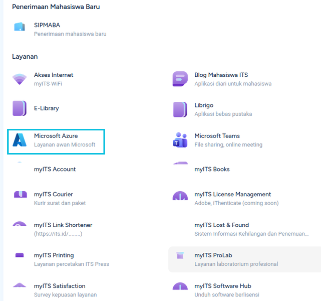
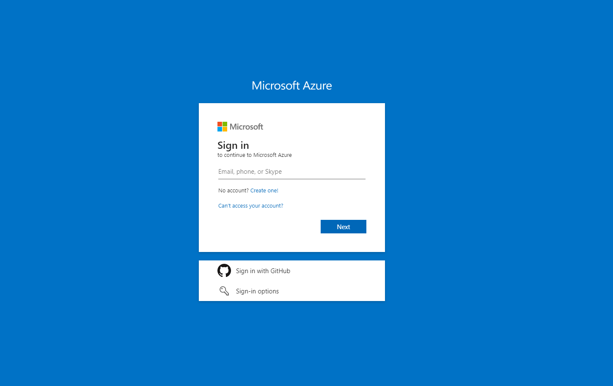
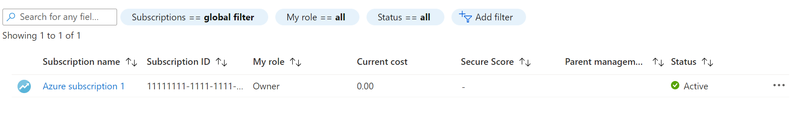
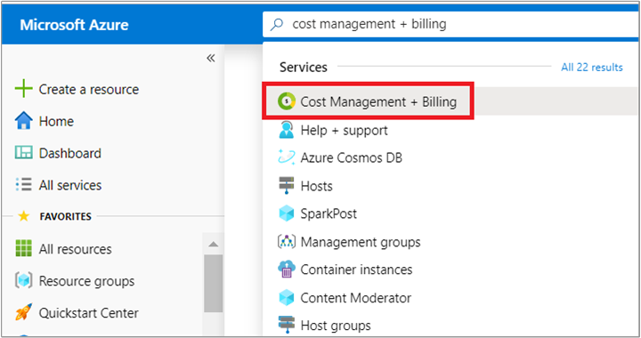
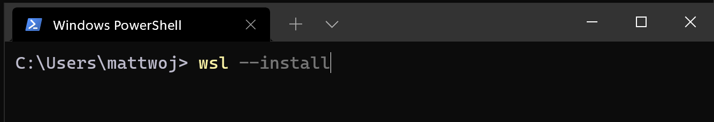
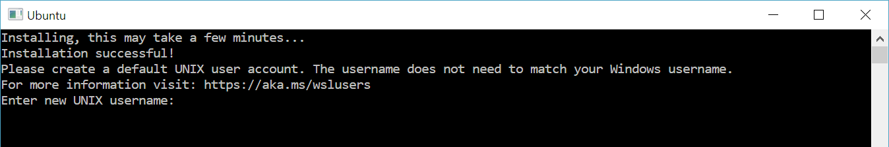
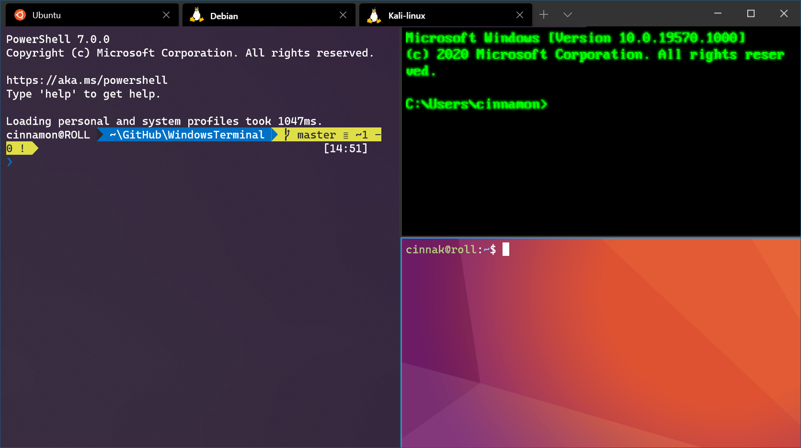
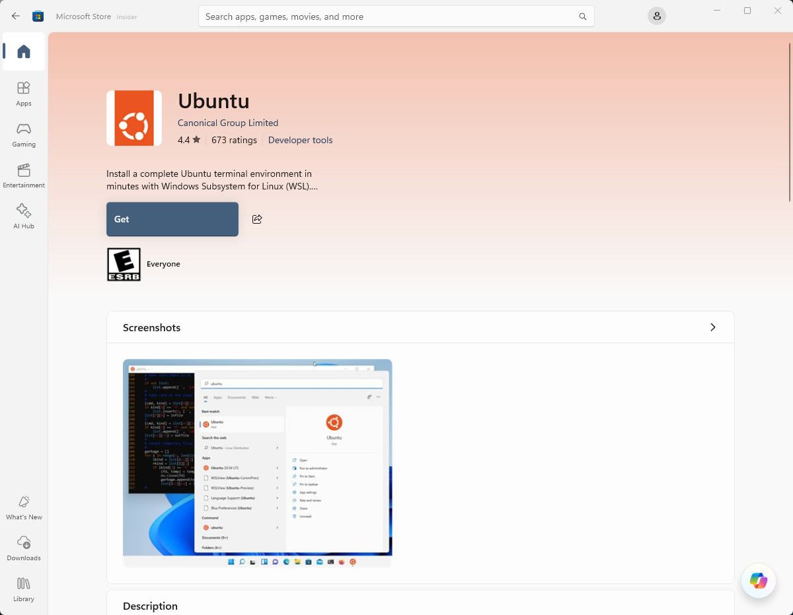
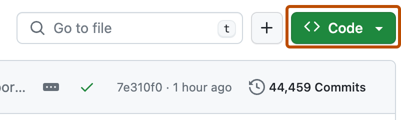
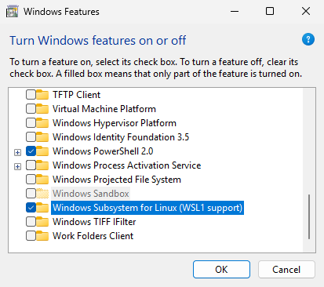

# Modul 0 - Prasyarat

**Kerjakan sebelum Pertemuan 1.** Secara mandiri.

Kalau ada yang macet, **tanya di grup/pc sebelum Pertemuan 1**, bukan pas hari-H.

---

## Apa saja yang disiapkan (dan kenapa)

| No | Yang disiapkan | Kegunaan | Dipakai di |
|----|----------------|----------|------------|
| 1 | Subscription Azure for Students | Kredit gratis untuk menjalankan VM | Pertemuan 1, 3, Final |
| 2 | Environment Linux (WSL2 di Windows) | Terminal asli untuk bekerja | Semua pertemuan |
| 3 | SSH client | Untuk login ke VM Azure | Pertemuan 1-3 |
| 4 | Git | Untuk `git clone` aplikasi web contoh | Pertemuan 2 |
| 5 | Akun GitHub | Untuk mengambil repo aplikasi (dan push image nanti) | Pertemuan 2, Final |

Di bagian akhir ada **checklist bukti setup** yang harus dikumpulkan. Itu cara kami mendeteksi masalah lebih awal.

---

## Langkah 1 - Aktivasi Azure for Students dengan akun ITS

**Kabar baik:** ITS sudah memakai **Microsoft 365** untuk email mahasiswa, jadi akun `@student.its.ac.id` kamu **sudah berupa akun Microsoft**. Kamu **tidak perlu** membuat akun Microsoft baru, dan proses verifikasi akademik biasanya **otomatis** karena domain ITS sudah dikenali Microsoft.

**Yang kamu dapat:** kredit **USD 100**, berlaku **12 bulan**, **tanpa kartu kredit**. Bisa diperpanjang tiap tahun selama masih berstatus mahasiswa aktif. Itu lebih dari cukup untuk seluruh rangkaian lab ini.

**Yang kamu butuhkan:**
- Email ITS format `[NRP]@student.its.ac.id`, contoh `5025xxxxxx@student.its.ac.id`
- Password myITS
- Aplikasi authenticator di HP (login Microsoft 365 ITS memakai MFA)

### Cara A - lewat portal myITS (disarankan)

1. Buka **<https://my.its.ac.id>** dan login dengan email ITS + password myITS.
2. Pada menu **Layanan**, cari dan pilih **Microsoft Azure**.
3. Ikuti proses login SSO myITS sampai kamu diarahkan ke portal Azure.
   

### Cara B - langsung dari halaman Azure for Students

1. Buka **<https://azure.microsoft.com/free/students>** lalu klik **Start free**.
2. Di halaman sign in, masukkan **email ITS kamu**, bukan Gmail atau email pribadi.

   

3. Kamu akan diarahkan ke halaman login myITS. Masukkan password myITS dan selesaikan verifikasi authenticator.
4. Lengkapi data profil dan verifikasi nomor HP kalau diminta. **Tidak akan ada permintaan kartu kredit.**

**Catatan:** kalau email pribadi (Gmail, Yahoo, Outlook pribadi) dipakai, pendaftaran akan ditolak di tahap verifikasi akademik. Gunakan email ITS.

### Verifikasi hasilnya

Buka **<https://portal.azure.com>**, lalu ketik **Subscriptions** di kolom pencarian atas. Harus muncul satu subscription dengan **Status: Active**.



Nama subscription kamu akan tertulis **"Azure for Students"**, bukan "Azure subscription 1", dan Subscription ID-nya milik kamu sendiri.

### Cek sisa kredit

Di kolom pencarian portal, ketik **Cost Management + Billing**, lalu masuk ke menu **Credits**.



Harusnya tertera sisa sekitar **USD 100.00**. Catat juga **tanggal kedaluwarsanya** - kredit hangus 12 bulan setelah aktivasi, berapa pun sisanya.

### Cara menjaga kredit, baca sekali biar tidak menyesal

- Kita hanya akan memakai VM kelas **B1s / B2ats**. VM B1s yang menyala 24 jam sehari menghabiskan sekitar **USD 8-10 per bulan**, jadi kredit USD 100 aman untuk seluruh lab.
- **Matikan (deallocate) VM lewat portal Azure kalau sedang tidak dipakai.** Kalau kamu hanya `shutdown` dari dalam Linux, VM-nya tetap dihitung sebagai berjalan dan tetap menagih kredit. Pakai tombol **Stop** di portal, karena itu yang benar-benar men-deallocate.
- Kalau kredit habis, Azure akan **menonaktifkan** subscription kamu, bukan menagih uang, karena tidak ada kartu kredit yang terdaftar. Tapi subscription yang nonaktif berarti tidak ada VM saat hari demo, jadi jangan habiskan kredit untuk VM besar atau GPU hanya karena penasaran.

**Kalau aktivasi gagal atau akun myITS bermasalah**, jangan diam saja. Laporkan ke **<https://servicedesk.its.ac.id>** dan pilih tujuan **DPTSI**, lalu kabari panitia. Urus ini sekarang, jangan H-1 Pertemuan 1.

---

## Langkah 2 - Menyiapkan environment Linux

Pilih bagian sesuai perangkat yang kamu pakai.

### Windows - WSL2 + Ubuntu

WSL2 (Windows Subsystem for Linux) memberi kamu terminal Ubuntu asli di dalam Windows. Tidak perlu dual boot, tidak perlu mengurus VM.

**Syarat:** Windows 11, atau Windows 10 versi 2004 ke atas (build 19041 atau lebih tinggi). Cek dengan mengetik `winver` di menu Start.

1. Buka **PowerShell sebagai Administrator** (klik kanan tombol Start, pilih *Terminal (Admin)* atau *Windows PowerShell (Admin)*).
2. Jalankan:

   ```powershell
   wsl --install
   ```

   

   Perintah ini mengaktifkan fitur Windows yang dibutuhkan, memasang WSL2, dan memasang Ubuntu sebagai distribusi default.

3. **Restart komputer.** Ini wajib. WSL tidak akan berfungsi sebelum kamu restart.
4. Setelah restart, Ubuntu terbuka otomatis dan meminta kamu membuat **username dan password UNIX**:

   

   - Username **tidak harus sama** dengan username Windows. Gunakan huruf kecil, tanpa spasi.
   - **Password tidak terlihat saat diketik.** Itu normal, bukan terminalnya yang hang. Ketik saja lalu tekan Enter.
   - **Ingat password ini.** Kamu akan membutuhkannya setiap kali menjalankan `sudo`.

5. Perbarui paket:

   ```bash
   sudo apt update && sudo apt upgrade -y
   ```

**Cara membuka terminal Ubuntu berikutnya:** tekan Start lalu ketik `Ubuntu`, atau buka **Windows Terminal** dan pilih **Ubuntu** dari dropdown tab (tanda panah bawah di sebelah tombol `+`):



**Uji cepat** di dalam Ubuntu:

```bash
lsb_release -a       # harusnya Ubuntu 22.04 / 24.04 LTS
whoami               # username UNIX kamu
```

Lalu kembali ke **PowerShell**, pastikan kamu memakai WSL **versi 2**:

```powershell
wsl -l -v
```

```
  NAME      STATE           VERSION
* Ubuntu    Running         2
```

Kalau kolom `VERSION` menunjukkan `1`, perbaiki dengan:

```powershell
wsl --set-version Ubuntu 2
wsl --set-default-version 2
```

**Alternatif kalau `wsl --install` gagal:** pasang **Ubuntu** secara manual dari Microsoft Store. Lihat bagian [Troubleshooting](#troubleshooting--faq) di bawah.



### macOS

Kamu sudah punya terminal Unix. Tidak ada yang perlu dipasang.

1. Buka **Terminal** (`Cmd + Space`, ketik `Terminal`).
2. Pastikan berjalan normal:

   ```bash
   uname -a
   echo $SHELL
   ```

3. *Disarankan:* pasang [Homebrew](https://brew.sh), supaya Langkah 4 dan modul Docker nanti lebih mudah.

   ```bash
   /bin/bash -c "$(curl -fsSL https://raw.githubusercontent.com/Homebrew/install/HEAD/install.sh)"
   ```

Mac Intel maupun Apple Silicon sama-sama bisa dipakai.

### Linux

Langkah ini sudah selesai untuk kamu. Cukup pastikan:

```bash
uname -a
lsb_release -a   # atau: cat /etc/os-release
```

---

## Langkah 3 - Verifikasi SSH client

SSH adalah cara kamu masuk ke VM Azure nanti. Program ini **sudah terpasang** di macOS, Linux, WSL/Ubuntu, dan Windows versi baru. Kamu tinggal memastikannya.

Jalankan di terminal Linux/macOS (pengguna Windows: di dalam Ubuntu, bukan di PowerShell):

```bash
ssh -V
```

Output yang diharapkan, **OpenSSH 8.x ke atas** sudah aman:

```
OpenSSH_8.9p1 Ubuntu-3ubuntu0.10, OpenSSL 3.0.2 15 Mar 2022
```

**Ini salah satu screenshot yang harus dikumpulkan.**

**Catatan teknis:** `ssh -V` mencetak ke *stderr*, jadi kalau outputnya mau di-pipe, gunakan `ssh -V 2>&1`.

**Kalau muncul `ssh: command not found`** (jarang, biasanya pada image Ubuntu minimal):

```bash
sudo apt update && sudo apt install -y openssh-client
```

**Jangan membuat SSH key dulu.** Azure akan membuatkan key pair untuk kamu saat pembuatan VM di Pertemuan 1. Soal key akan dibahas langsung di sesi.

---

## Langkah 4 - Pasang Git

Git dipakai untuk mengambil aplikasi web contoh di Pertemuan 2.

**Windows (di dalam Ubuntu/WSL) dan Linux:**

```bash
sudo apt update && sudo apt install -y git
```

**macOS:**

```bash
brew install git
# atau, tanpa Homebrew, perintah ini memunculkan installer bawaan Apple:
xcode-select --install
```

Pengguna Windows: pasang Git **di dalam WSL/Ubuntu**. Git for Windows tidak dibutuhkan untuk lab ini. Kalau kamu sudah terlanjur punya, tidak masalah, hanya saja bukan itu yang akan kita pakai.

### Verifikasi

```bash
git --version
```

```
git version 2.34.1
```

**Ini salah satu screenshot yang harus dikumpulkan.**

### Atur identitas Git 

```bash
git config --global user.name  "your name"
git config --global user.email "your_email@gmail.com"
git config --global init.defaultBranch main
```

---

## Langkah 5 - Buat atau pastikan akun GitHub

Akun ini dibutuhkan untuk meng-clone aplikasi contoh, dan untuk stretch goal CI/CD di proyek akhir.

1. Kalau belum punya, daftar di **<https://github.com/signup>**.
2. **Verifikasi alamat email kamu.** GitHub akan mengirim kode. Akun yang belum terverifikasi hampir tidak bisa dipakai apa-apa.
3. Login, lalu buka repository publik mana saja. Pastikan kamu bisa melihat tombol hijau **Code** dan menyalin URL clone HTTPS. Persis inilah yang akan kamu lakukan di Pertemuan 2:

   

4. Uji supaya yakin proses clone benar-benar jalan:

   ```bash
   git clone https://github.com/ncclaboratory18/lbe-2026
   ```

   Kalau berhasil tanpa error, berarti sudah beres.

**Opsional:** dengan email ITS kamu juga bisa mengajukan [GitHub Student Developer Pack](https://education.github.com/pack) - Copilot gratis, private repo, dan sejumlah kredit layanan lain. Tidak wajib untuk lab ini.

---

## Langkah 6 - Bukti setup (dikumpulkan)

Jalankan perintah berikut di terminal Linux/macOS. Satu blok ini menghasilkan semua yang dibutuhkan dalam satu screenshot:

```bash
echo "=== USER ===";  whoami
echo "=== OS ===";    lsb_release -ds 2>/dev/null || sw_vers -productVersion
echo "=== SSH ===";   ssh -V 2>&1
echo "=== GIT ===";   git --version
```

### Checklist pengumpulan

- [ ] Screenshot output blok perintah di atas (satu screenshot sudah mencakup OS, SSH, dan Git)
- [ ] Screenshot halaman **Subscriptions** di portal Azure dengan **Status: Active**
- [ ] Screenshot **sisa kredit** Azure (Cost Management + Billing, menu Credits)
- [ ] Username GitHub kamu (cukup ditulis)
- [ ] Khusus pengguna Windows: output `wsl -l -v` yang menunjukkan **VERSION 2**

**Batas waktu: 24 jam sebelum Pertemuan 1.** Itu memberi waktu untuk membantu kamu, bukan menemukan masalahnya saat sesi berlangsung.

**Tutup atau potong bagian Subscription ID** kalau screenshot diunggah ke grup. Bukan rahasia besar, tapi tidak ada alasan untuk memublikasikannya.

---

## Troubleshooting / FAQ

Sebagian besar orang yang macet, macetnya di WSL. Cari pesan error kamu di bawah.

### `wsl --install` tidak dikenali atau tidak melakukan apa-apa

Versi Windows kamu terlalu lama. Cek `winver`. Dibutuhkan Windows 10 build **19041 ke atas** atau Windows 11. Perbarui Windows, atau tempuh jalur manual: pasang **Ubuntu** dari Microsoft Store lalu aktifkan fitur Windows seperti pada gambar di bawah.

### Error `0x80370102` - "the virtual machine could not be started"

Virtualisasi hardware belum aktif. Ada dua hal yang perlu dicek:

1. **Di Windows:** tekan Start, cari *Turn Windows features on or off*, centang **Virtual Machine Platform** dan **Windows Subsystem for Linux**, klik OK, lalu restart.

   

2. **Di BIOS/UEFI:** restart dan masuk ke setup BIOS (biasanya tombol `F2`, `F10`, atau `Del` saat booting), lalu aktifkan **Intel VT-x** atau **AMD-V** (kadang tertulis *SVM Mode* atau *Virtualization Technology*). Simpan dan keluar.

Pastikan juga di **Task Manager - Performance - CPU** tertulis *Virtualization: Enabled*.

### Error `0x8007019e` atau `0x80073d05`

Komponen opsional WSL belum aktif. Jalankan di **PowerShell (Admin)**, lalu restart:

```powershell
dism.exe /online /enable-feature /featurename:Microsoft-Windows-Subsystem-Linux /all /norestart
dism.exe /online /enable-feature /featurename:VirtualMachinePlatform /all /norestart
```

### WSL2 bentrok dengan VirtualBox, VMware, atau emulator Android

WSL2 memakai Hyper-V. VirtualBox versi lama (di bawah 6.x) dan sebagian emulator tidak bisa berjalan berdampingan dengannya. Perbarui VirtualBox ke versi terbaru, atau terima kenyataan bahwa hanya salah satu yang bisa jalan dalam satu waktu. Ini tidak berpengaruh pada lab kita.

### Ubuntu terbuka lalu langsung tertutup

Biasanya instalasi yang tidak selesai. Reset dengan:

```powershell
wsl --unregister Ubuntu
wsl --install -d Ubuntu
```

**Perhatian:** `--unregister` **menghapus seluruh isi** instalasi Ubuntu tersebut. Aman dilakukan sekarang karena isinya memang masih kosong.

### Lupa password Ubuntu di WSL

Di **PowerShell**, masuk sebagai root:

```powershell
wsl -u root
```

Lalu di dalamnya:

```bash
passwd username-kamu
```

### `apt update` gagal atau tidak ada internet di dalam WSL

Umumnya masalah DNS, sering dipicu VPN (termasuk myITS VPN). Putuskan VPN lalu coba lagi, atau restart WSL dari PowerShell:

```powershell
wsl --shutdown
```

Setelah itu buka Ubuntu kembali.

### Login Azure ditolak, atau akun myITS bermasalah

- Pastikan kamu memakai format `[NRP]@student.its.ac.id`, bukan email pribadi dan bukan domain `@its.ac.id` milik dosen atau tendik.
- Kalau password myITS lupa atau akun belum aktif, ajukan tiket ke **<https://servicedesk.its.ac.id>** dengan tujuan **DPTSI**.
- Kalau verifikasi authenticator gagal, pastikan aplikasi authenticator di HP sudah terhubung dengan akun ITS kamu.
- Kalau tetap tidak bisa, **kabari panitia**. Jangan diam-diam melewatkan Pertemuan 1.

### Perlu memasang Docker sekarang?

**Tidak.** Docker kita pasang bersama-sama di Pertemuan 2. Memaksakan Docker Desktop jalan lebih awal adalah pemborosan waktu yang umum terjadi. Jangan dulu.

### Perlu VM Windows atau dual boot?

Tidak. WSL2 sudah cukup untuk semua kebutuhan lab ini.

### Bisa pakai Azure Cloud Shell di browser saja?

Untuk Modul 0, tidak. Kami memang ingin memastikan terminal lokal kamu berfungsi, karena di Pertemuan 3 kamu akan menjalankan loop request ke load balancer dari mesin kamu sendiri.

---

## Sebelum Pertemuan 1, semua ini harus sudah bisa kamu jawab "ya"

- [ ] Subscription Azure for Students saya **Active** dan kreditnya masih ada
- [ ] Saya bisa membuka **terminal Linux** (WSL/Ubuntu, Terminal macOS, atau Linux langsung)
- [ ] `ssh -V` menampilkan versi
- [ ] `git --version` menampilkan versi
- [ ] Saya sudah login GitHub dan bisa clone repo publik
- [ ] Saya sudah mengumpulkan screenshot bukti setup

---

**Referensi**

- [Microsoft Azure - DPTSI ITS](https://www.its.ac.id/dptsi/microsoft-azure/)
- [Microsoft 365 Mahasiswa - DPTSI ITS](https://www.its.ac.id/dptsi/office-365-mahasiswa/)
- [Email Mahasiswa Baru - DPTSI ITS](https://www.its.ac.id/dptsi/email-mahasiswa-baru/)
- [myITS Servicedesk](https://servicedesk.its.ac.id)

