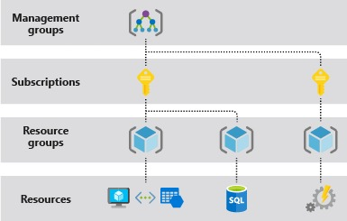
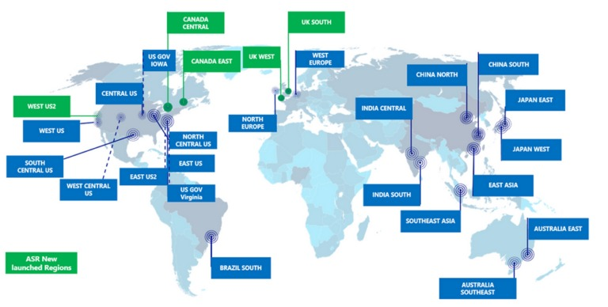

# Pertemuan 1 LBE NCC 2026

## Daftar Isi

- [Tujuan Pembelajaran](#tujuan-pembelajaran)
- [Dasar-dasar Cloud Computing](#dasar-dasar-cloud-computing)
  - [Pengertian Cloud](#pengertian-cloud)
  - [Perbandingan Dulu vs Sekarang](#perbandingan-dulu-vs-sekarang)
  - [Model Layanan](#model-layanan)
  - [Model Penyebaran](#model-penyebaran)
  - [Keuntungan dan Tantangan](#keuntungan-dan-tantangan)
- [Apa Itu VPS?](#apa-itu-vps)
  - [Definisi](#definisi)
  - [VPS vs Jenis Hosting Lain](#vps-vs-jenis-hosting-lain)
- [Konsep Dasar Azure](#konsep-dasar-azure)
  - [Resource Group](#resource-group)
  - [Shared Resource Group](#shared-resource-group)
  - [Region](#region)
  - [VM Size / Tier](#vm-size--tier)
- [Persiapan Sebelum Hands-On](#persiapan-sebelum-hands-on)
  - [Apa itu SSH dan Key Pair](#apa-itu-ssh-dan-key-pair)
- [Hands On 1](#hands-on-1)
  - [Membuat Resource Group dan VM](#membuat-resource-group-dan-vm)
- [Hands On 2](#hands-on-2)
  - [SSH ke VM](#ssh-ke-vm)
- [Hands On 3](#hands-on-3)
  - [Sanity Check di Dalam VM](#sanity-check-di-dalam-vm)

## Tujuan Pembelajaran

Setelah menyelesaikan modul ini, kamu akan bisa:

- Memahami apa itu VPS dan bedanya dengan jenis hosting lain.
- Memahami konsep dasar Azure: resource group, region, ukuran/tier VM, dan cakupan Free/Student credit.
- Membuat resource group dan Virtual Machine di Azure Portal.
- Mengakses VM dari terminal lokal menggunakan SSH.
- Menjalankan pengecekan dasar Linux di VM dan menyajikan halaman sederhana lewat HTTP.

---

## Dasar-dasar Cloud Computing

### Pengertian Cloud

Cloud merupakan simbol atau perumpamaan dari internet, sedangkan computing berarti pemrosesan menggunakan komputer. Jadi, cloud computing adalah penggunaan sumber daya komputasi (seperti server, storage, network, dsb.) melalui internet yang dilakukan secara on-demand (sesuai kebutuhan) dan tagihannya dibayarkan dengan harga sesuai pemakaian (pay-as-you-go).

Penerapan yang sepenuhnya menggunakan teknologi cloud. Terdapat 2 opsi dalam membangun aplikasi cloud-based:

- Low-level infrastructure: Kita masih memerlukan staf IT untuk mengelola server.
- Higher-level service: Dengan layanan serverless yang mampu mengurangi kebutuhan pengelolaan, arsitektur, dan scaling (penyesuaian kapasitas) pada infrastruktur. **serverless** disini memiliki arti bahwa server masih digunakan tetapi sepenuhnya dikelola oleh penyedia cloud, sehingga client hanya fokus pada penulisan dan menjalankan kode, tanpa perlu khawatir tentang infrastruktur di belakangnya.

### Perbandingan Dulu vs Sekarang

| **Aspek**              | **Dulu (Sebelum Cloud Computing)**                                             | **Sekarang (Dengan Cloud Computing)**                                 |
| ---------------------- | ------------------------------------------------------------------------------ | --------------------------------------------------------------------- |
| **Infrastruktur**      | Harus membangun data center sendiri                                            | Tidak perlu data center fisik, cukup sewa layanan cloud               |
| **Biaya Awal**         | Tinggi: pembelian server, rak komputer, sistem penyimpanan, instalasi jaringan | Rendah: bayar sesuai pemakaian (_pay as you go_)                      |
| **Operasional**        | Harus membayar listrik, pendingin, kebersihan, keamanan, dan sewa gedung       | Semua dikelola oleh penyedia cloud (Microsoft Azure, AWS, dsb.)       |
| **Skalabilitas**       | Sulit menambah kapasitas, harus beli perangkat keras baru                      | Skalabilitas mudah dan cepat, tinggal tambah resource di portal cloud |
| **Waktu Implementasi** | Lama, perlu perencanaan, instalasi, dan konfigurasi manual                     | Cepat, bisa deploy aplikasi dalam hitungan menit                      |
| **Fleksibilitas**      | Terbatas pada kapasitas fisik yang dimiliki                                    | Sangat fleksibel, bisa menyesuaikan kebutuhan kapan saja              |
| **Keamanan**           | Ditanggung penuh oleh perusahaan (biaya tambahan)                              | Keamanan tingkat enterprise disediakan penyedia cloud                 |

### Model Layanan

Secara umum model layanan pada sistem cloud terbagi menjadi:


- On-Premise : Terkadang disebut sebagai private cloud, user bertanggung jawab untuk memanajemen seluruh resource yang ada, seperti virtualisasi server, perawatan hardware, cabling, penyusunan rak, update software, dan data center sendiri.
- IaaS (Infrastructure as a Service): User tidak perlu memanajemen infrastruktur (termasuk hardware), karena telah disediakan cloud provider. Contohnya adalah ketika menyewa virtual machine pada cloud provider. Kita tidak perlu membeli hardware sendiri secara fisik, tetapi kita dapat memilih OS yang ingin digunakan maupun aplikasi yang ingin diinstall pada VM tersebut.
- PaaS (Platform as a Service): Penyedia layanan mengelola infrastruktur, sistem operasi, dan middleware. user hanya perlu mengelola aplikasi dan data.
- SaaS (Software as a Service): Penyedia layanan mengelola semuanya, mulai dari infrastruktur hingga aplikasi. User hanya perlu menggunakan aplikasi dan mengelola datanya.

### Model Penyebaran

Secara umum model penyebaran pada sistem cloud terbagi menjadi:

- Cloud Hybrid : Jenis komputasi cloud yang menggabungkan infrastruktur lokal atau cloud private dengan cloud public. Cloud hybrid memungkinkan data dan aplikasi berpindah di antara dua lingkungan.
- Cloud Public : Sumber daya cloud (seperti server dan penyimpanan) dimiliki dan dioperasikan oleh penyedia cloud pihak ketiga dan dikirim melalui internet. Dengan cloud publid, semua perangkat keras, perangkat lunak, dan infrastruktur pendukung lainnya dimiliki dan dikelola oleh penyedia cloud.
- Cloud Private : Sumber daya komputasi cloud yang digunakan eksklusif oleh satu organisasi, baik di pusat data internal maupun dihosting pihak ketiga, dengan layanan dan infrastruktur tetap berada di jaringan privat.

### Keuntungan dan Tantangan

Keuntungan Cloud Computing:

- Efisiensi Biaya
- Skalabilitas
- Fleksibilitas & Aksesibilitas
- Kecepatan Implementasi
- Keamanan Tingkat Lanjut
- Inovasi Cepat

Tantangan Cloud Computing:

- Ketergantungan pada Internet
- Kontrol Terbatas
- Keamanan & Privasi Data
- Biaya Tidak Terduga
- Kebutuhan Regulasi
- Vendor Lock In

## Apa Itu VPS?

### Definisi

VPS (Virtual Private Server) adalah satu komputer fisik (server) yang dibagi menjadi beberapa "komputer virtual" yang terpisah, menggunakan teknologi virtualisasi. Setiap VPS punya sistem operasi sendiri, resource (CPU, RAM, storage) yang dijatah, dan berjalan independen dari VPS lain di server fisik yang sama — meskipun secara fisik mereka berbagi satu mesin.

### VPS vs Jenis Hosting Lain

| Jenis                        | Ciri Utama                                                                                                                                                      | Kontrol Pengguna                               |
| ---------------------------- | --------------------------------------------------------------------------------------------------------------------------------------------------------------- | ---------------------------------------------- |
| **Shared Hosting**           | Satu server dipakai bareng banyak akun, resource tidak dijatah tegas antar akun                                                                                 | Sangat terbatas, tidak ada akses root          |
| **VPS**                      | Server fisik dipartisi virtual, tiap VPS punya resource terjatah & OS sendiri                                                                                   | Akses root/admin penuh ke OS-nya               |
| **Dedicated Server**         | Satu server fisik hanya untuk satu pengguna                                                                                                                     | Kontrol penuh atas hardware juga               |
| **Cloud VM (mis. Azure VM)** | Seperti VPS, tapi dikelola lewat platform cloud dengan layer manajemen tambahan (resource group, region, auto-scaling, dsb.) dan resource bisa diubah on-demand | Akses root/admin penuh + tools manajemen cloud |

---

## Konsep Dasar Azure

### Resource Group



Resource group adalah "wadah" atau folder logis untuk mengelompokkan resource Azure yang saling terkait (VM, storage, network, dll.) dalam satu project. Tujuannya supaya kamu bisa mengelola, memantau biaya, atau menghapus semua resource sekaligus tanpa harus mencari satu per satu.

**Contoh:** semua resource untuk project LBE NCC dijadikan satu kedalam esource group bernama `LBE-NCC`.

### Shared Resource Group

---

#### Apa yang Bisa Dilakukan Contributor

Role Contributor berlaku di **level resource group**, bukan cuma ke resource yang dia buat sendiri. Artinya begitu seseorang jadi Contributor di suatu RG, dia otomatis bisa melakukan hal berikut ke **SEMUA** resource di RG itu — termasuk VM milik anggota lain:

| Bisa                                                             | Tidak Bisa                                                                                         |
| ---------------------------------------------------------------- | -------------------------------------------------------------------------------------------------- |
| Start / Stop / Restart / Deallocate VM siapa pun di RG           | SSH masuk ke VM orang lain (beda jalur — butuh private key `.pem` atau public key terdaftar di VM) |
| Delete VM siapa pun di RG (termasuk VM yang bukan miliknya)      | Mengubah role assignment / akses IAM orang lain                                                    |
| Mengubah konfigurasi VM siapa pun (size, networking, disk, dll.) | Mengatur billing / kredit langganan                                                                |
| Membuat VM baru miliknya sendiri di RG                           | Menghapus resource group itu sendiri (kecuali diberi hak tambahan)                                 |

Satu resource group bisa dipakai bareng-bareng oleh satu kelompok — tiap anggota tetap bikin VM masing-masing, tapi semua VM terkumpul dalam RG yang sama supaya gampang dipantau dan dihapus sekaligus setelah selesai.

Ini diatur lewat Access Control (IAM), fitur Azure untuk mengatur siapa boleh ngapain di suatu resource (role-based access control / RBAC). Dua role yang perlu kamu tahu:

| Role            | Akses                                                     | Cocok Untuk                                            |
| --------------- | --------------------------------------------------------- | ------------------------------------------------------ |
| **Owner**       | Bikin/hapus resource, ubah akses orang lain, atur billing | Orang yang pertama kali bikin resource group (default) |
| **Contributor** | Bikin/hapus resource (VM, dll.) di dalam RG               | Anggota kelompok lain                                  |

**Cara setup resource group**

1. Buka resource group yang sudah dibuat (contoh: `LBE-NCC`).
2. Di menu kiri, klik **"Access control (IAM)"**.
3. Klik **"+ Add"** → **"Add role assignment"**.
4. Di daftar role, cari dan pilih **"Contributor"**, lalu klik **"Next"**.
5. Pada bagian **"Assign access to"**, pastikan terpilih **"User, group, or service principal"**.
6. Klik **"+ Select members"**, ketik nama atau email akun Azure anggota kelompok, pilih dari hasil pencarian.
7. Klik **"Review + assign"** → **"Review + assign"** .


### Region



Region adalah lokasi geografis data center Azure tempat VM kamu benar-benar berjalan (misalnya Southeast Asia/Singapura, atau East US). Region mempengaruhi latency (semakin dekat ke lokasi kamu, semakin cepat responnya) dan kadang harga. Untuk latihan, pilih region terdekat dari lokasi kamu — untuk Indonesia biasanya **"Southeast Asia"**.

### VM Size / Tier


VM size menentukan spesifikasi virtual machine kamu: jumlah vCPU, RAM, dan kadang jenis storage yang didukung. Size ditulis dengan kode seperti `B1s`, `B2s`, `D2s_v3`, dst. Untuk belajar, kamu akan pakai `B1s` atau ukuran setara — ini adalah tier kecil yang cukup untuk eksperimen dan biasanya termasuk dalam kuota gratis/student.

---

## Persiapan Sebelum Hands-On

### Apa itu SSH dan Key Pair

SSH (Secure Shell) adalah cara aman untuk "masuk" dan mengendalikan komputer lain dari jarak jauh lewat terminal, seolah-olah kamu duduk di depan komputer itu. Alih-alih login pakai password, cara yang lebih aman dan umum dipakai adalah key pair - dua file yang saling berpasangan:

- **Private key** — disimpan di komputer kamu, **JANGAN** dibagikan ke siapa pun.
- **Public key** — dipasang di server (VM), bisa dilihat orang lain.

Saat membuat VM di Azure, kamu akan diminta membuat key pair baru. Azure akan otomatis membuatkan public-private key dan meminta kamu mengunduh file private key (`.pem`). File ini yang nanti dipakai terminal untuk login ke VM.

**PENTING BANGETTTT:** File `.pem` hanya bisa diunduh **SEKALI** saat VM dibuat. Simpan di folder yang mudah diingat, misalnya folder `Documents/azure-keys`. Jangan **HILANG**.

---

## Hands on 1

### Membuat Resource Group dan VM

1. Login ke [portal.azure.com](https://portal.azure.com).
   
2. Ketik **"Resource groups"** di search bar.
   
3. Klik **"+ Create"**, isi nama resource group (contoh: `LBE-NCC`), pilih region **"East Asia"**, lalu klik **"Review + create"** → **"Create"**.
   
4. Kembali ke kolom pencarian, ketik **"Virtual machines"** lalu klik **"+ Create"** → **"Azure virtual machine"**.
   
5. Pada tab **Basics**, isi:
   - Resource group: pilih yang tadi dibuat
     
   - Virtual machine name: contoh `VM_LBE_NCC`
     
   - Region: samakan dengan resource group
     
   - Image: pilih **"Ubuntu Server 24.04 LTS"**
     
   - Size: klik **"See all sizes"** lalu pilih size lain yang ditandai eligible untuk student
6. Pada bagian **Administrator account**, kalian bisa memilih untuk menggunakan **"SSH public"** key atau **"password"**. Untuk keamanan lebih sebaiknya gunakan 
   authentication type **"SSH public key"**, biarkan Azure generate key pair baru, beri nama key pair `VM-LBE-NCC_key`.
   ** diizinkan. Nanti di Hands-on 3 kita juga akan butuh port **8000** — boleh ditambahkan sekarang atau nanti lewat Networking tab VM.
   
9. Klik **"Review + create"**, tunggu validasi selesai, lalu klik **"Create"**.
10. Jangan lupa **"Download private key and create resource"** klik itu untuk mengunduh file `.pem`, lalu tunggu proses deployment.
   
11. Setelah selesai, buka resource VM tersebut dan catat **"Public IP address"** yang tertera di halaman Overview.

---

## Hands on 2

### SSH ke VM

Pindahkan file `.pem` yang tadi diunduh ke folder yang mudah diakses lewat terminal, misalnya ke folder `Documents`. Copy path dari file `.pem` kalian.


```bash
ssh -i <Path Priveate Key> azureuser@<PUBLIC_IP>
```

Ganti `<PUBLIC_IP>` dengan IP yang dicatat sebelumnya.

Ganti `<Path Private Key>` dengan PATH yang dicatat sebelumnya.


Saat login pertama, akan muncul pertanyaan _"Are you sure you want to continue connecting (yes/no)?"_ — ketik `yes`. Jika berhasil, prompt terminal akan berubah menampilkan nama user dan VM, menandakan kamu sekarang "berada" di dalam VM, bukan di komputer lokal lagi.

---

## Hands on 3

## Sanity Check di Dalam VM

Update daftar package:

```bash
sudo apt update
```

Cek IP address VM dari dalam OS untuk konfirmasi:

```bash
curl ifconfig.me
```

Jalankan server HTTP sederhana bawaan Python di folder aktif:

```bash
python3 -m http.server 8000
```

Buka browser di komputer lokal kamu, akses:

```
http://<PUBLIC_IP>:8000
```


Kamu akan melihat daftar file di folder VM ditampilkan sebagai halaman web. Ini menandakan VM kamu berhasil "melayani" sesuatu lewat internet.

> Jika halaman tidak muncul, kemungkinan besar port 8000 belum diizinkan di Inbound port rules — kembali ke Azure Portal, buka **VM → Networking → Add inbound port rule**, izinkan port 8000.

Tekan `Ctrl+C` di terminal VM untuk menghentikan server setelah selesai tes.

---
