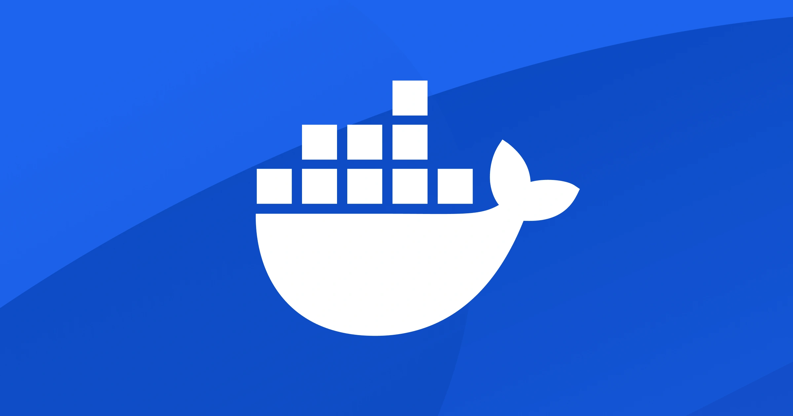
*source: https://docs.docker.com/images/thumbnail.webp*
# Modul 2 LBE NCC - Docker
## Prasyarat

### Install Docker

Sebelum masuk ke Materi 1 Open Recruitment NCC 2026 yang membahas Docker, pastikan Docker sudah terpasang di laptop atau komputer kalian. Kalau belum, silakan install terlebih dahulu sesuai dengan sistem operasi yang digunakan.

#### Linux

Kalau kalian menggunakan Linux, silakan install Docker dengan mengikuti panduan resmi berikut, lalu pilih instruksi sesuai dengan distro yang digunakan: [Docker Installation Guide](https://docs.docker.com/engine/install/)


#### Windows
 
- Pastikan bahwa WSL2 sudah terinstall, jika belum, ikuti langkah-langkah di [Instalasi WSL 2](https://pureinfotech.com/install-windows-subsystem-linux-2-windows-10/) (hanya berlaku untuk versi win 10 versi 2004 ke atas, termasuk win11)
- Download installer docker desktop di [Instalasi Docker](https://www.docker.com/products/docker-desktop) (ukuran 490 MB) (docker desktop sudah include docker engine dan docker compose)
- Jalankan installernya, lalu pencet  ok/ install, lalu tunggu selama sekitar 2 menit
- Docker sudah terinstall

> Jika muncul peringatan `WSL 2 requires an update to its kernel component.` ketika aplikasi dijalankan, download link berikut: [WSL Update x64](https://wslstorestorage.blob.core.windows.net/wslblob/wsl_update_x64.msi), jalankan setup wizard yang sudah didownload, kemudian buka kembali aplikasi docker

#### MacOS
_kebutuhan sistem minimal: macOS versi 11 dengan ram 4 GB_

##### GUI
- Download installer melalui link berikut: [Instalasi Docker](https://www.docker.com/products/docker-desktop)
- Jalankan installernya, kemudian drag ikon Docker menuju ikon folder _Application_ 
- Jalankan aplikasinya dari Launchpad atau folder _Application_
- Jika muncul peringatan "Are you sure you want to open it?", tekan open
- Baca terms and condition dan tekan accept
- Pilih recommended setting dan tekan ok
- Masukkan password mac dan tunggu hingga proses selesai

##### Terminal
- Cek apakah Homebrew sudah terinstall
    ```
    brew --version
    ```
- Jika belum, install homebrew terlebih dahulu
    ```
    /bin/bash -c "$(curl -fsSL https://raw.githubusercontent.com/Homebrew/install/master/install.sh)"
    ```
- Install docker
    ```
    brew install --cask docker
    ```
- Jalankan docker
    ```
    open /Applications/Docker.app
    ```
- Jika muncul peringatan "Are you sure you want to open it?", tekan open
- Baca terms and condition dan tekan accept
- Pilih recommended setting dan tekan ok
- Masukkan password mac dan tunggu hingga proses selesai


## Apa itu Docker?

Pernah kesal pas ngejalanin kode kalian di komputer kalian jalan, tapi begitu dikasih ke orang lain, malah error?

Bisa jadi karena aplikasi kalian butuh sesuatu yang ada di komputer kalian, tapi nggak ada di komputer temen kalian. Bisa versi Python-nya beda, library yang kepasang beda, atau setting environment yang beda.

Coba bayangin gini: kalian masak mie pakai kecap asin merk A di rumah, rasanya pas. Tapi pas kalian masak mie yang sama di tempat lain pakai kecap asin merk B, rasanya jadi beda. Padahal resepnya sama persis!

Nah, daripada repot nyesuaiin "bahan-bahan" (dependency) di setiap komputer, kenapa nggak kita paketin aja semua bahan yang dibutuhin jadi **satu paket lengkap** kayak mie instan. Di dalam satu rasa mie instan udah ada mie, bumbu, minyak, kecap, semuanya. Tinggal masak, jadi deh. Mau dimasak di rumah kalian, di rumah temen, atau di kosan siapapun, rasanya bakal **tetap sama**, karena bahannya sama-sama dari satu paket itu.

**Docker itu ibarat mie instan.** Docker membungkus aplikasi kalian beserta semua yang dibutuhkannya (dependency, library, konfigurasi) jadi satu paket yang disebut **image**. Paket ini bisa dijalankan di komputer manapun dan hasilnya akan selalu konsisten nggak peduli itu laptop kalian, laptop temen, atau server di kantor. Konsep inilah yang dinamakan **Kontainerisasi**

---

## Docker vs VM
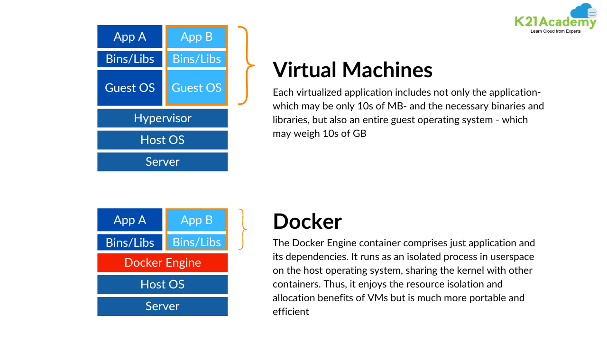
*source: https://k21academy.com/wp-content/uploads/2020/11/Docker-and-Vm-blog-image-1_result-1.webp*

Mungkin kalian bertanya, gimana caranya Docker bisa "ngepack" semua itu jadi satu kayak mie instan?

Docker melakukan **isolasi environment**. Artinya, Docker membuat "ruang" sendiri buat aplikasi kalian lengkap dengan filesystem-nya sendiri (folder, file, library) yang terpisah dari sistem utama komputer kalian. Jadi walaupun di komputer kalian ada Python versi 3.8, container Docker kalian bisa aja punya Python versi 3.11 di dalamnya, dan keduanya nggak akan bentrok.

Tapi Docker melakukan isolasi ini dengan cara **berbagi kernel/OS** milik komputer host (komputer utama). Jadi Docker nggak menjalankan sistem operasi baru dari nol, dia cuma mengisolasi filesystem, proses, dan network-nya aja.

### Terus, bedanya sama VM (Virtual Machine) apa?

Mungkin kalian pernah denger soal VM juga. Nah, ini bedanya:

Kalau Docker itu kayak mie instan panci yang dipakai buat masak **sama** (kernel OS-nya sama, dipinjam dari host), tapi hasil dan isinya bisa beda-beda tergantung paketnya.

Kalau VM itu lain lagi. VM itu kayak kalian punya alat masak yang **beda-beda total** buat masakan yang beda-beda: mau masak nasi pakai rice cooker, mau manggang pakai oven, mau presto pakai panci presto. Masing-masing alat itu punya "dunia"-nya sendiri, lengkap dan berdiri sendiri dari nol.

Kenapa beda? Karena VM menjalankan **sistem operasi lengkap** di dalamnya (lewat hypervisor), termasuk kernel-nya sendiri. Jadi tiap VM itu berat, butuh resource besar, dan boot-nya lama mirip kayak nyalain oven dari dingin banget. Sedangkan Docker container cuma menjalankan aplikasinya aja di atas kernel yang dipinjam dari host, jadi jauh lebih ringan dan cepat nyala, mirip kayak masak mie instan yang tinggal rebus air terus jadi.

### Tabel Komparasi Docker vs VM 

| Aspek | Docker (Container) | Virtual Machine |
|---|---|---|
| Level Isolasi | Level proses & filesystem | Level sistem operasi penuh |
| Kernel/OS | Berbagi kernel host | Punya kernel/OS sendiri |
| Ukuran | Ringan (MB) | Berat (bisa puluhan GB) |
| Waktu nyala | Hitungan detik | Bisa hitungan menit |
| Penggunaan resource | Efisien | Lebih boros |
| Analogi | Mie instan (panci sama, isi beda) | Oven vs panci vs presto (alat beda-beda) |

---

## Istilah-istilah Pada Docker
### Docker Registry
Docker Registry adalah "gudang" atau "warung" tempat image Docker disimpan dan didistribusikan. Kalau tadi image itu ibarat mie instan yang udah jadi, registry adalah warungnya tempat kalian beli (atau taruh) mie instan itu.

Registry publik yang paling umum dipakai adalah **Docker Hub**, tempat kalian bisa `pull` image resmi seperti `nginx`, `postgres`, atau `python`. Tapi registry juga bisa privat, misalnya perusahaan punya registry sendiri (contohnya GitHub Container Registry, Amazon ECR, atau Docker Registry self-hosted) buat nyimpen image internal yang nggak boleh sembarangan diakses orang luar.

Alur singkatnya:
- `docker push` → upload image kalian ke registry.
- `docker pull` → download image dari registry ke komputer kalian.

### Docker Image
Docker Image adalah "cetakan" atau "resep beku" dari aplikasi kalian, isinya kode, dependency, library, sampai konfigurasi yang dibutuhin buat ngejalanin aplikasi tersebut. Image ini **read-only** (tidak berubah) dan disusun berlapis-lapis (disebut **layer**), di mana tiap instruksi di Dockerfile (`FROM`, `COPY`, `RUN`, dst) biasanya bikin satu layer baru.

Kalau dianalogikan ke mie instan, Image itu ibarat bungkusan mie instan yang masih tersegel, belum dimasak. Isinya udah lengkap dan pasti, tapi belum "hidup" atau berjalan.

Image ini yang nantinya dijalankan buat jadi Container.

### Docker Container
Docker Container adalah "hasil masak" dari sebuah Image, alias instance yang sedang berjalan (running) dari suatu Image. Kalau Image itu resep/bungkusan yang statis, Container adalah wujud aktifnya yang punya proses, memory, dan network sendiri.

Dari **satu** Image yang sama, kalian bisa menjalankan **banyak** Container sekaligus, masing-masing terisolasi satu sama lain. Ibaratnya, dari satu bungkus mie instan yang sama (Image), kalian bisa masak berkali-kali (Container 1, Container 2, dst), dan tiap masakan itu independen, kalau yang satu keasinan, yang lain nggak ikut kena.

Container ini bersifat **stateless** secara default, artinya begitu container dihapus, semua perubahan data di dalamnya ikut hilang, kecuali datanya disimpan lewat Docker Volume (lihat bagian selanjutnya).

### Docker Volume
Docker Container berjalan dengan stateless (tidak bisa menyimpan data secara permanen). Untuk itu, ada yang namanya Docker Volume, yaitu sebuah cara agar docker container bisa menyimpan data secara permanen. Bayangkan Docker Volume  seperti perangkat penyimpanan eksternal, dia hanya akan menyimpan data saja, tapi tidak menjalankan prosesnya. Ketika penyimpanan eksternal tersebut dicabut dari komputer, data tidak akan hilang meskipun data di komputernya hilang semua. Berikut 2 cara menggunakan docker Volume
- Volumes: Managed entirely by Docker and stored in a dedicated directory on the host filesystem (/var/lib/docker/volumes/ on Linux). This is the preferred method for persisting data.

- Bind Mounts: Mapping a specific file or directory from the host machine directly into the running container, allowing external processes to read and write to host storage.


## Cara Pakai Docker

Udah pada tau kan sekarang apa itu Docker dan kenapa dia beda dari VM? Sekarang kita coba praktik cara pakainya.

### 3.1 Pakai "mie instan" yang udah jadi (`docker pull` & `docker run`)

Banyak banget software di luar sana yang udah nyediain paketan Docker-nya sendiri (disebut **image**), jadi kalian tinggal "beli mie instan yang udah jadi" tanpa perlu bikin dari awal.

Contoh, kita mau jalanin web server Nginx pakai Docker:

```bash
# ambil image nginx dari Docker Hub (kayak beli mie instan di warung)
docker pull nginx

# jalanin image tadi jadi container (kayak masak mie-nya)
docker run -d -p 8080:80 nginx
```

Penjelasan singkat:
- `docker pull nginx` → download paket image Nginx.
- `docker run -d -p 8080:80 nginx` → jalanin container-nya di background (`-d`), dan hubungkan port 8080 di komputer kalian ke port 80 di dalam container (`-p`).

important docker run OPTIONS:
| nama option | kegunaan |
| ----------- | -------- |
| `-d` | **Detach**: docker akan dijalankan di background |
| `-p [COMPUTER_PORT]:[DOCKER_PORT]` | **publish**: menghubungkan port open di docker dengan port komputer mu, jadi biar bisa akses port nya docker, pakai COMPUTER_PORT untuk menghubungkan |
| `--name` | **name**: Memberikan nama kepada containter yang dijalankan |
|`-e` `--env`| **environment**: emmbuat environment variable baru di dalam docker container. e.g. `-e API_LINK=api.gogogo.com/v1/`|
|`--rm`| Menghapus container ketika containernya distop / dimatikan|

**Sekilas network port dan Docker run -p**
- **network port**
port adalah identifier dalam protokol jaringan (terutama TCP/IP) yang memungkinkan satu komputer mengelola beberapa koneksi atau layanan sekaligus. Port berupa identifikasi logis yang membedakan layanan atau aplikasi berbeda di suatu alamat IP. Analoginya, kalian bisa bayangkan pc kalian itu adalah sebuah bangunan kantor. Di kantor tersebut, terdapat banyak ruangan kantor. Nah, port itu adalah pintu masuk ke setiap ruangan kantor itu. Terdapat beberapa network port yang sudah *"reserved"* atau sudah digunakan oleh komputer pada umumnya, contohnya seperti port 22: SSH, port 80: HTTP, port 443: HTTPS, dan lain-lain. Selain port-port yang sudah direserced oleh komputer, kita bisa menggunakan sembarang port untuk aplikasi yang kita buat \
\
analogi kantor: \
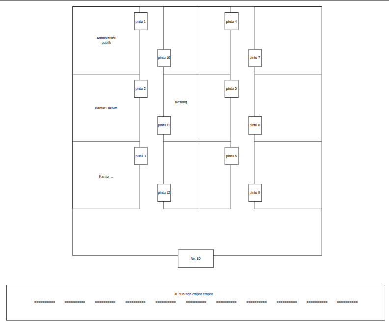
\
contoh untuk port: \
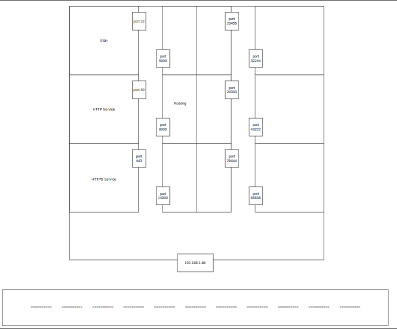

- **publish port docker**
Nah, sekarang kita sudah tahu bahwa sebuah PC dapat menggunakan port sebagai identifier untuk membedakan berbagai service atau aplikasi yang berjalan di dalamnya. Pada Docker, setiap container juga memiliki jaringan dan portnya sendiri. Namun, port yang digunakan oleh service di dalam container tidak secara otomatis dapat diakses melalui port pada komputer kita (host). Oleh karena itu, Docker menyediakan argumen -p atau --publish untuk menghubungkan atau memetakan port pada host dengan port pada container.
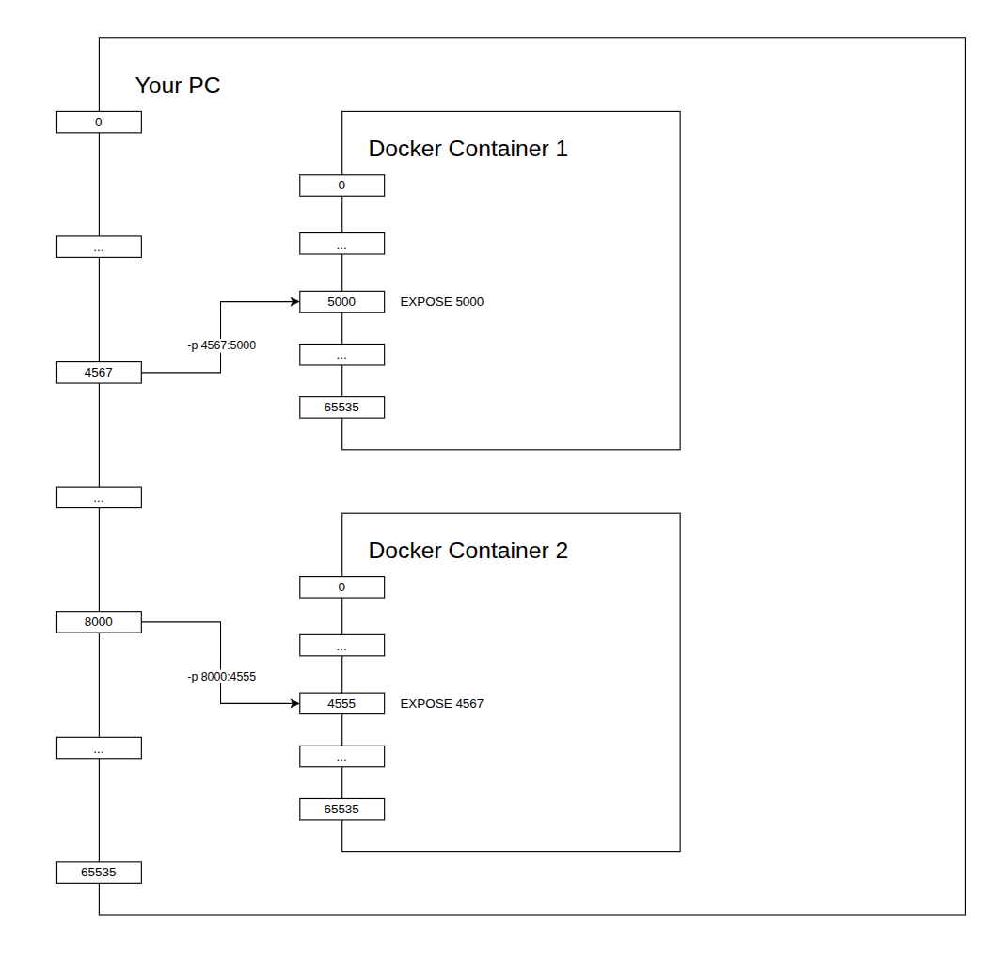

Sekarang coba buka `http://localhost:8080` di browser, harusnya muncul halaman default Nginx. Gampang kan? Tinggal "beli" dan "masak", langsung jadi.

### 3.2 Tambahin bumbu sendiri (Dockerfile)

Kadang, mie instan biasa aja kurang mantap, kalian mau nambahin bumbu sendiri telur, sayur, atau bahan lain. Nah, di Docker, "resep tambahan bumbu" ini ditulis di file yang namanya **Dockerfile**.

Contoh Dockerfile sederhana buat aplikasi Node.js:

```dockerfile
# Ambil base image
FROM python:3.14-alpine 
# biasanya, versi alpine memiliki size yang lebih kecil, sehingga hasil akhirnya pun lebih kecil

# Change directory
WORKDIR /app

# Copying files from your computer into image
COPY . .

# Run necessary command when building
# E.G. install dependensi/module python
RUN pip install -r requirements.txt

# Bilang bahwa image ini menggunakan port 5000
EXPOSE 8080


# Command yang dijalankan ketika image ini menjadi kontainer
CMD ["python", "server.py"]
```

Setelah Dockerfile-nya jadi, kita "masak" jadi image baru:

```bash
# Pertama bungkus jadi 1 image
docker build -t aplikasi-saya ./

# Lalu masak agar bisa dijalankan
docker run -d -p 3000:3000 aplikasi-saya
```

Jadi, kalian ambil dasar (base image) yang udah ada, terus ditambahin "bumbu" sesuai kebutuhan aplikasi kalian sendiri.

Jika ingin menjalankan docker image yang sudah dibungkus menggunakan `build`, tidak perlu melakukan build kembali. Langsung saja menggunakan `docker run`. 

**Beberapa hal penting soal Dockerfile:**

- **Urutan instruksi itu penting.** Docker membangun image layer per layer, dan tiap layer di-cache. Kalau kalian `COPY . .` (copy semua file) sebelum `RUN pip install`, maka setiap kali ada file yang berubah sedikit aja, cache-nya batal dan `pip install` bakal jalan ulang dari awal, walaupun `requirements.txt`-nya nggak berubah. Makanya, praktik yang lebih baik adalah copy file dependency dulu, install, baru copy sisa kodenya:

```dockerfile
FROM python:3.14-alpine
WORKDIR /app

# copy file dependency dulu biar layer install bisa di-cache
COPY requirements.txt .
RUN pip install -r requirements.txt

# baru copy sisa kode aplikasi
COPY . .

EXPOSE 8080
CMD ["python", "server.py"]
```

- **`.dockerignore`** berguna buat ngecualiin file/folder yang nggak perlu ikut masuk ke image (misalnya `.git`, `node_modules`, `venv`, atau file environment lokal), mirip seperti `.gitignore`. Ini bikin proses build lebih cepat dan image jadi lebih kecil serta lebih aman (nggak sengaja ikut ke-bundle file rahasia).

- **`CMD` vs `RUN`**: `RUN` dieksekusi sekali aja pas proses **build** image (misalnya buat install dependency), sedangkan `CMD` baru dieksekusi pas container **dijalankan** (`docker run`).

> **Coba sendiri:** buat file `requirements.txt` sederhana isi satu library, tulis Dockerfile seperti contoh di atas, lalu build dan run image-nya. Coba ubah salah satu file kode kalian (bukan `requirements.txt`), build ulang, dan perhatikan di terminal, langkah `RUN pip install` seharusnya langsung pakai cache (`CACHED`) karena `requirements.txt`-nya nggak berubah.

### Bikin dari nol (`FROM scratch`)

Kalau di Dockerfile sebelumnya kita mulai dari base image yang udah ada isinya (misal `node:20`), Docker juga ngasih opsi buat mulai bener-bener dari nol, pakai `FROM scratch`.

```dockerfile
FROM scratch
COPY app-binary /app-binary
CMD ["/app-binary"]
```

Ini artinya kalian nggak minjem "resep dasar" siapa-siapa kalian racik sendiri semuanya dari nol, nggak ada isi bawaan apapun (nggak ada OS, nggak ada tools). Cara ini biasanya dipakai untuk bikin image yang **super ringan dan minimalis**, contohnya buat aplikasi yang di-compile jadi binary tunggal (seperti dari Go). Cocok kalau kalian pengen kontrol penuh atas isi image, walaupun butuh usaha lebih karena nggak ada tools bawaan sama sekali.

---

## Docker Workflow
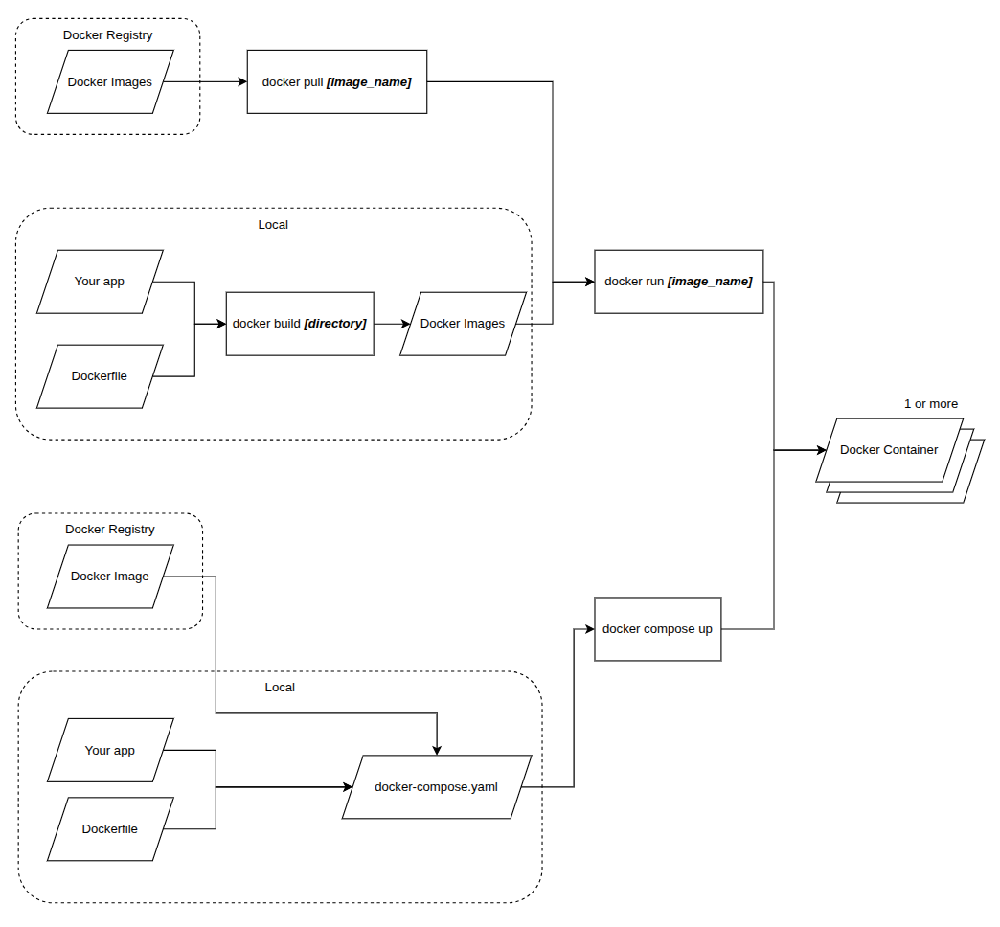

## Important Docker Command / Scripts
### Container Related
| Perintah  | Deskripsi |
| --------- | --------- |
| `attach` | Menjalankan perintah pada container yang sedang berjalan. Perintah ini akan memasukkan pengguna ke dalam sesi terminal container. |
| `commit` | Membuat sebuah image baru dari perubahan yang dilakukan pada container yang sedang berjalan. |
| `cp` | Menyalin file atau direktori antara file sistem host dan file sistem dalam container. |
| `create` | Membuat sebuah container baru, tetapi tidak menjalankannya. |
| `diff` | Menunjukkan perubahan pada file sistem container yang sedang berjalan. |
| `exec` | Menjalankan sebuah perintah pada container yang sedang berjalan. |
| `export` | Mengekspor sebuah container ke dalam file tar. |
| `inspect` | Melihat detail dari sebuah container. |
| `kill` | Menghentikan sebuah container yang sedang berjalan secara paksa. |
| `logs` | Melihat log dari sebuah container. |
| `ls` | Menampilkan daftar container yang sedang berjalan. |
| `pause` | Menjeda sebuah container yang sedang berjalan. |
| `port` | Menampilkan port yang dibuka oleh sebuah container. |
| `prune` | Menghapus container yang tidak sedang berjalan. |
| `rename` | Mengubah nama dari sebuah container yang sedang berjalan. |
| `restart` | Menghidupkan kembali sebuah container yang sedang berjalan. |
| `rm` | Menghapus sebuah container yang sedang berjalan. |
| `run` | Membuat sebuah container baru dan menjalankannya. |
| `start` | Menjalankan sebuah container yang telah dibuat. |
| `stats` | Menampilkan informasi CPU, memori, dan jaringan dari sebuah container yang sedang berjalan. |
| `stop` | Menghentikan sebuah container yang sedang berjalan. |
| `top` | Menampilkan proses yang sedang berjalan di dalam sebuah container. |
| `unpause` | Meneruskan sebuah container yang telah dijeda. |
| `update` | Memperbarui sebuah container dengan konfigurasi baru. |
| `wait` | Menunggu container selesai menjalankan sebuah perintah sebelum melanjutkan. |


### Image Related

| Perintah  | Deskripsi |
| --------- | --------- |
| `build` |  Perintah ini digunakan untuk membuat sebuah image Docker dari Dockerfile. |
| `history` | Menampilkan riwayat perubahan pada sebuah image. |
| `import` | Mengimpor sebuah image dari sebuah file. File tersebut harus berisi image yang telah diekspor sebelumnya dengan perintah **`docker save`** |
| `inspect` | Melihat detail dari sebuah image. |
| `load` | Memuat sebuah image dari sebuah arsip yang telah disimpan. |
| `ls` | Menampilkan daftar image yang telah terunduh. |
| `prune` | Menghapus image yang tidak terpakai. |
| `pull` | Mengunduh sebuah image dari Docker Hub atau registry lainnya. |
| `push` | Mengunggah sebuah image ke Docker Hub atau registry lainnya. |
| `rename` | Mengubah nama dari sebuah image yang telah terunduh. |
| `rm` | Menghapus sebuah image yang telah terunduh. |
| `save` | Menyimpan sebuah image ke dalam sebuah arsip yang dapat diunduh dengan menggunakan perintah **`docker load`** |
| `tag` | Memberikan sebuah tag pada sebuah image. |

### Dockerfile Related

| Perintah | Deskripsi |
| ------------ | ------------ |
| `FROM` | Menentukan base image yang akan digunakan untuk build. |
| `COPY` | Menyalin file atau folder dari host ke dalam image. |
| `ADD` | Menyalin file atau folder dari host ke dalam image, bisa juga digunakan untuk men-download file dari URL dan mengekstraknya ke dalam image. |
| `RUN` | Menjalankan perintah pada layer yang sedang dibangun dan membuat image baru. |
| `CMD` | Menentukan perintah default yang akan dijalankan saat container di-start. |
| `ENTRYPOINT` | Menentukan perintah yang akan dijalankan saat container di-start, dapat juga di-overwrite oleh perintah saat container di-run. |
| `ENV` | Menentukan environment variable di dalam container. |
| `EXPOSE` | Menentukan port yang akan di-expose dari container ke host. |
| `VOLUME` | Menentukan direktori yang akan di-mount sebagai volume di dalam container. |


## Docker Compose

Sejauh ini kita baru jalanin **satu** container aja (misalnya cuma Nginx, atau cuma aplikasi Node.js). Tapi di dunia nyata, aplikasi biasanya butuh lebih dari satu service yang saling terhubung misalnya aplikasi backend, database, dan cache, yang masing-masing jalan di container terpisah.

Kalau harus jalanin satu-satu pakai `docker run` dengan banyak parameter, itu ribet dan gampang salah. Di sinilah **Docker Compose** berguna.

Docker Compose adalah tool untuk mendefinisikan dan menjalankan aplikasi yang terdiri dari **banyak container sekaligus**, menggunakan satu file konfigurasi berformat YAML bernama `docker-compose.yml`.

Contoh `docker-compose.yml` untuk aplikasi web + database:

```yaml
version: "3.9"
services:
  web:
    build: .
    ports:
      - "3000:3000"
    depends_on:
      - db

  db:
    image: postgres:16
    environment:
      POSTGRES_PASSWORD: rahasia
      POSTGRES_DB: aplikasi_db
    volumes:
      - db_data:/var/lib/postgresql/data

volumes:
  db_data:
```

Untuk menjalankannya, cukup satu perintah:

```bash
docker compose up -d
```

Perintah ini akan otomatis:
- Build image untuk service `web` (kalau ada `build`).
- Pull image `postgres:16` untuk service `db`.
- Menjalankan kedua container tersebut sekaligus.
- Menghubungkan keduanya dalam satu network internal, sehingga service `web` bisa langsung berkomunikasi dengan `db` cukup pakai nama service-nya (misalnya `db:5432`).

Dengan Docker Compose, konfigurasi seluruh aplikasi (berapa banyak service, port apa aja, environment variable apa aja) tersimpan rapi dalam satu file, dan bisa dijalankan ulang kapan saja dengan hasil yang konsisten di komputer siapapun.

**Perintah-perintah Docker Compose yang sering dipakai:**

| Perintah | Deskripsi |
| -------- | --------- |
| `docker compose up` | Membuat (kalau perlu build dulu) dan menjalankan semua service yang didefinisikan di `docker-compose.yml`. |
| `docker compose up -d` | Sama seperti di atas, tapi dijalankan di background (detach). |
| `docker compose up --build` | Memaksa Docker untuk rebuild image sebelum menjalankan, berguna kalau ada perubahan di Dockerfile atau kode. |
| `docker compose down` | Menghentikan dan menghapus semua container, network yang dibuat oleh `up` (volume tidak ikut terhapus kecuali ditambah `-v`). |
| `docker compose ps` | Menampilkan status semua service/container yang didefinisikan di compose file. |
| `docker compose logs -f` | Melihat log dari semua service secara real-time (`-f` = follow). |
| `docker compose exec [service] [perintah]` | Menjalankan perintah di dalam container service yang sedang berjalan, misalnya masuk ke shell: `docker compose exec web sh`. |
| `docker compose restart [service]` | Merestart salah satu service tanpa perlu restart semuanya. |
| `docker compose build` | Hanya melakukan build image untuk service yang punya konfigurasi `build`, tanpa menjalankannya. |

**Kenapa `depends_on` penting?** Instruksi `depends_on` di contoh sebelumnya memastikan container `db` dijalankan/dinyalakan lebih dulu sebelum container `web`. Tapi perlu diingat, `depends_on` cuma nunggu container-nya *menyala*, bukan nunggu servis di dalamnya *siap* (misalnya database Postgres yang butuh beberapa detik buat benar-benar siap menerima koneksi). Untuk kasus seperti itu, biasanya dipakai mekanisme tambahan seperti `healthcheck` atau script retry di sisi aplikasi.

> **Coba sendiri:** pakai `docker-compose.yml` contoh di atas (service `web` + `db`), jalankan dengan `docker compose up -d`, lalu cek statusnya dengan `docker compose ps`. Coba juga `docker compose logs -f db` untuk lihat log database-nya, dan `docker compose down` buat mematikan semuanya sekaligus. Bandingkan berapa banyak perintah `docker run` yang dibutuhin kalau kalian jalanin service `web` dan `db` itu satu-satu secara manual.

## Hands On

### Docker run
- Pergi ke `https://hub.docker.com/` \
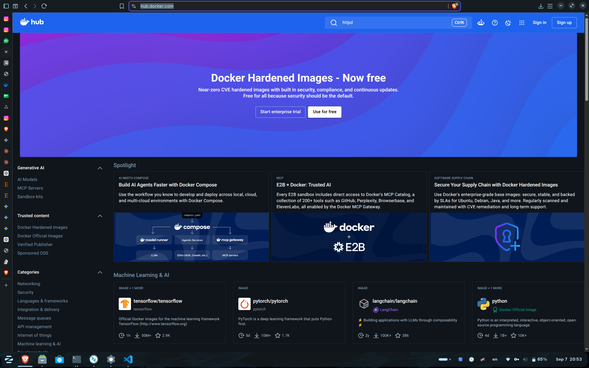
- Cari httpd \
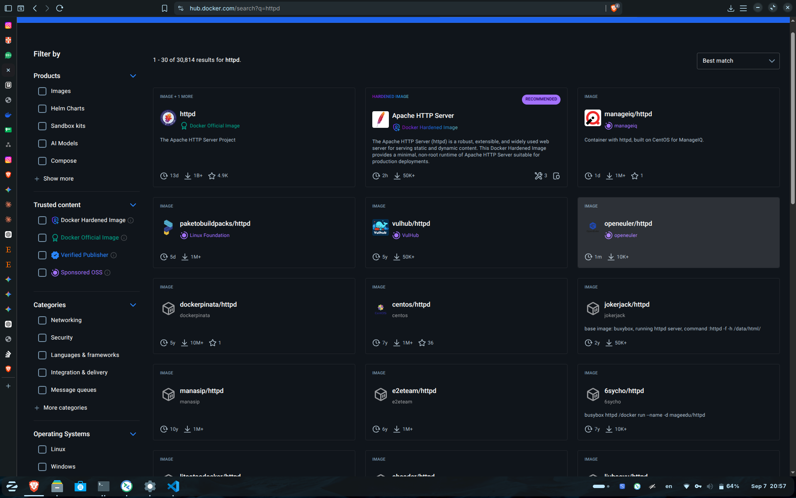
- Klik yang paling pertama
- Klik dropdown latest, pilih alpine3.24  \
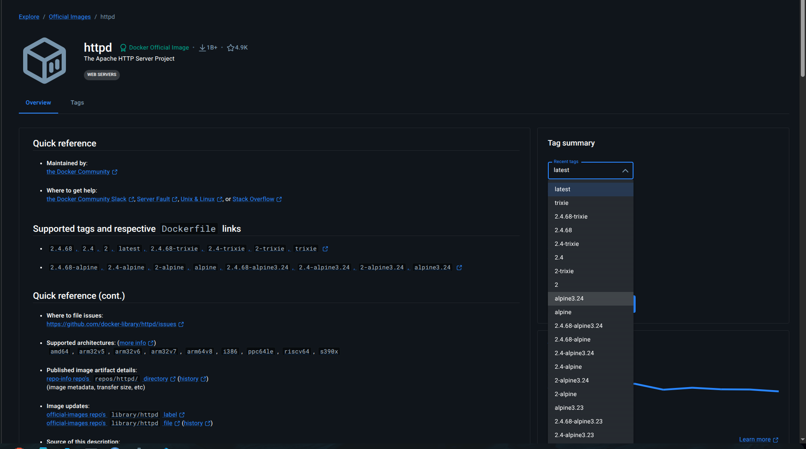
- Copy code docker pull \
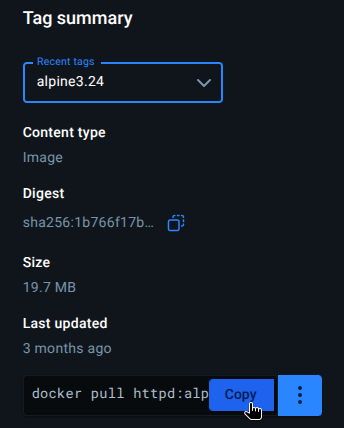
- Jalankan di terminal
- sebelum pull \
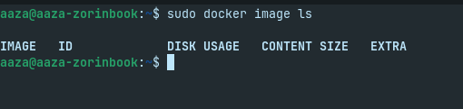
- pull \
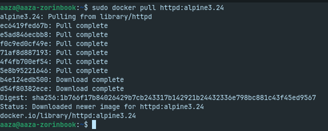
- setelah pull \
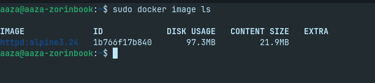
- jalankan menggunakan `docker run` (oada contoh kita gunakan port 4567) \
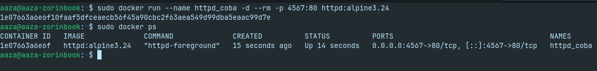
- cek `http://localhost:4567` (karena di docker run kita gunakan port 4567) \
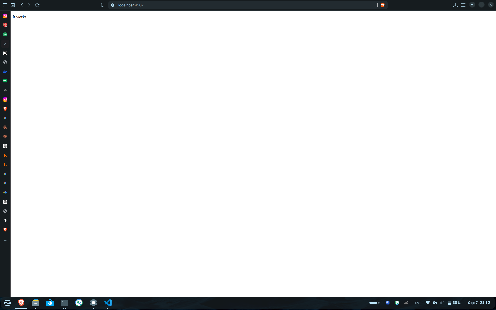
- matikan dengan `docker stop httpd_coba` \
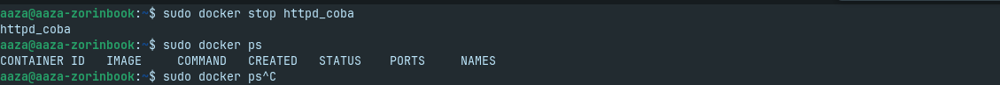
- cek `http://localhost:4567` lagi, tidak bisa diakses \
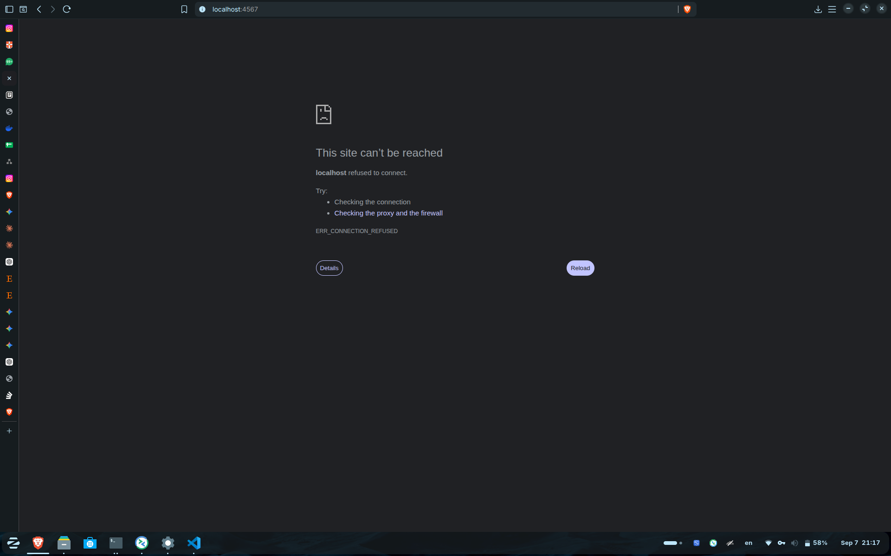

### Prep:
- Buat copy dari repo ini `https://github.com/azaregon/handson-lbe-docker` 
- Gunakan clone untuk clone repository github ini: `https://github.com/azaregon/handson-lbe-docker.git` \
```bash
git clone https://github.com/azaregon/handson-lbe-docker.git
```
- Download sebagai zip, lalu ekstrak \
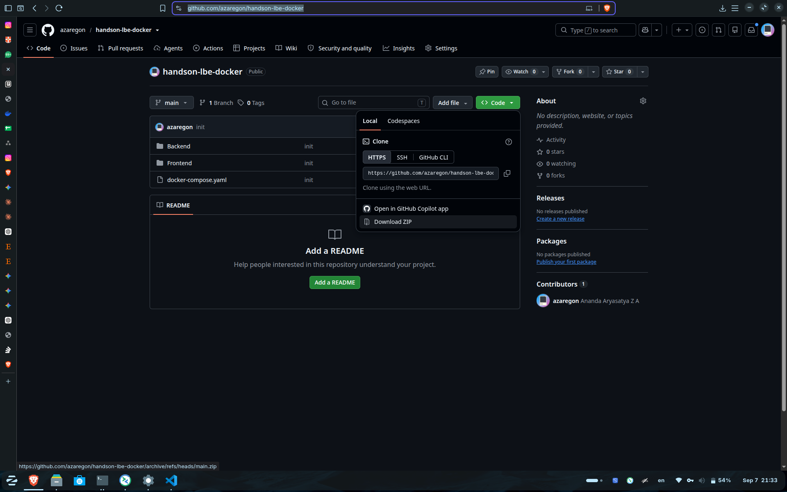

### Dockerfile
- Pergi ke direktori Backend repository yang baru kalian download/clone \
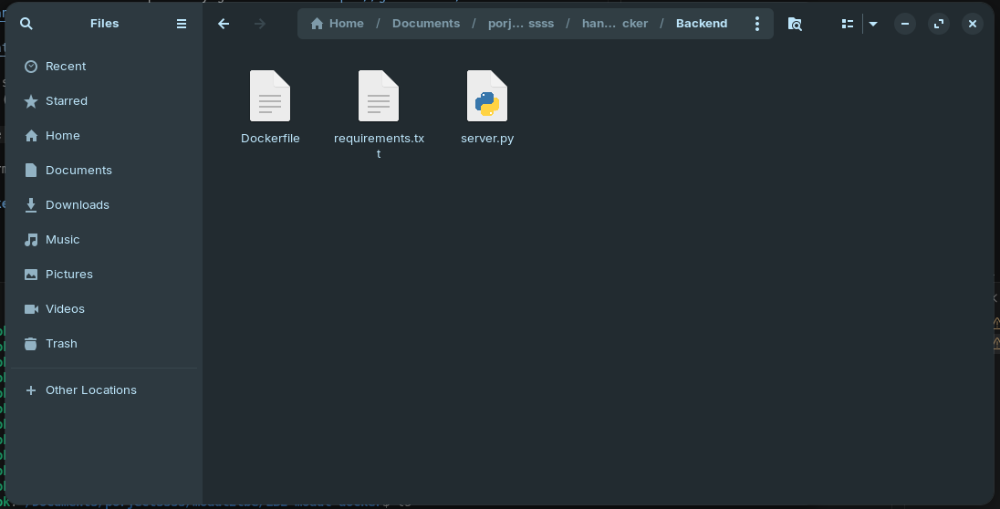
- buka Dockerfile di direktori tersebut \
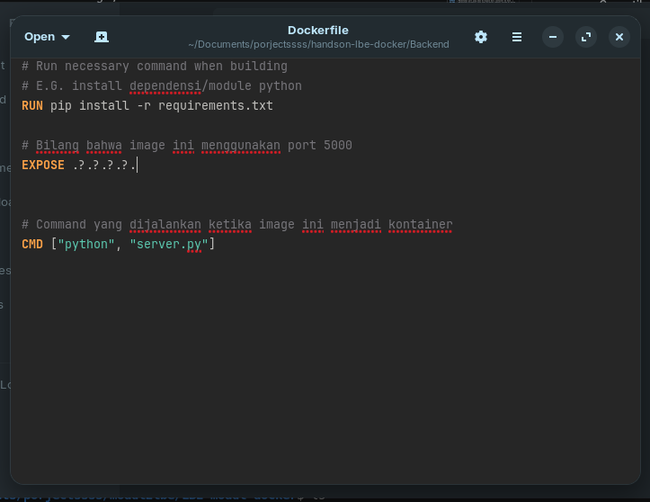
- Ganti .?.?.?.?. dengan: 
- `WORKDIR` dengan `/main_app` untuk menjadikan direktori `main_app` menjadi direktori utama 
- `EXPOSE` dengan `4444` untuk mengekspos port `4444` saat diajalankan menjadi container 
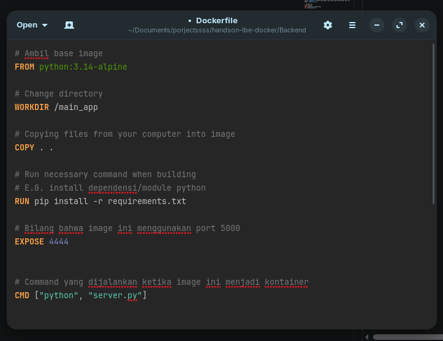

- jalankan build dengan (jangan lupa cd ke Backend/) \
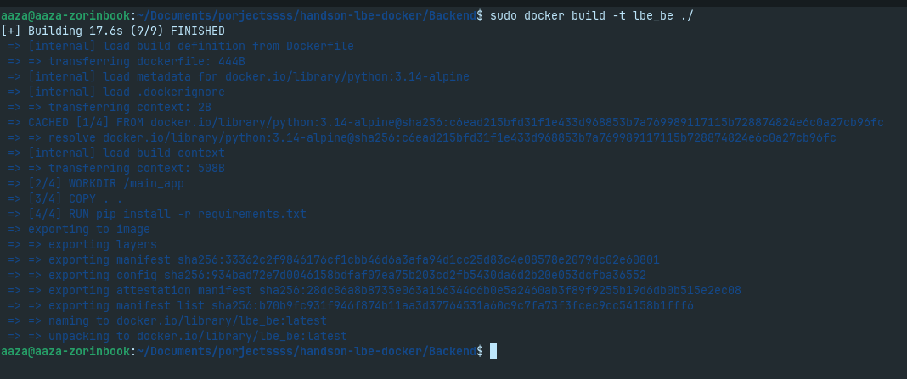
setelah menjalankan build \
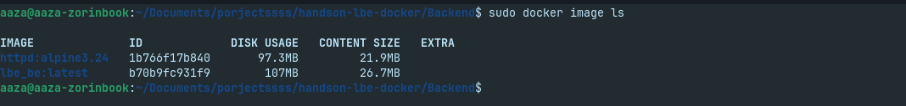

- jalankan container dengan docker run (disini kita buat agar port 10000 bisa mengakses port 4444 dalam container kita) \
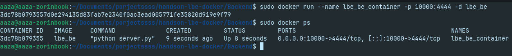

- Cek di web browser url: `http://localhost:10000/health`  \
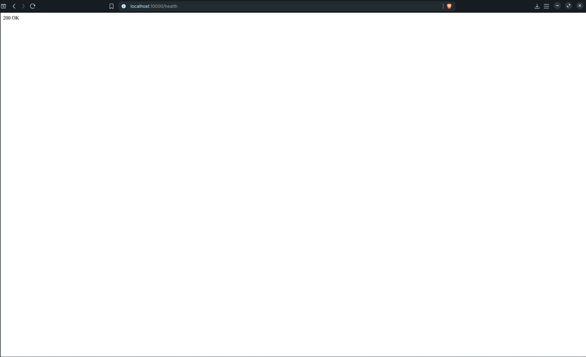

- stop container dengan: `docker stop` dan hapus container dengan: `docker rm` \
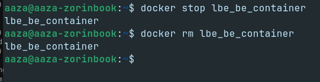

### Docker compose
- Pergi ke folder yang tadi kalian clone \
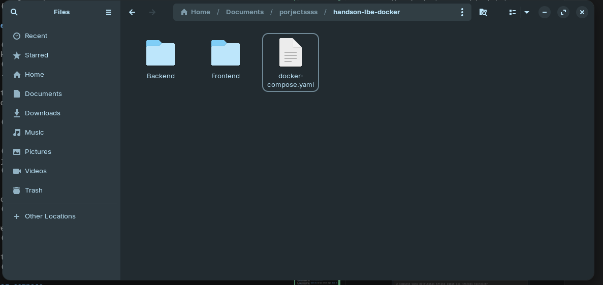
- Buka docker-coompose.yaml \
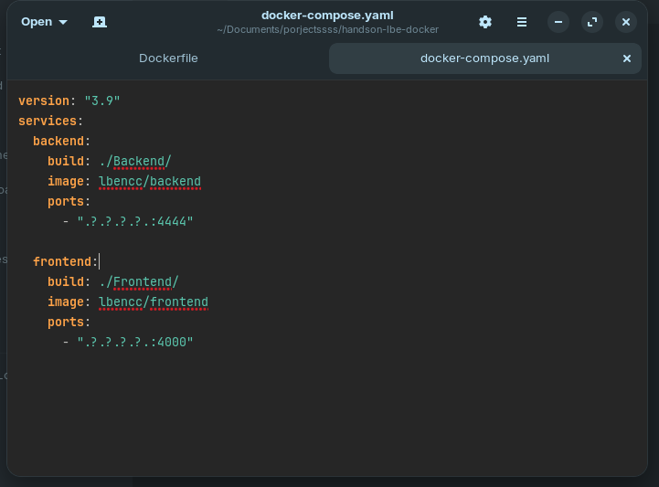
- Ganti .?.?.?.?. \
- Ganti .?.?.?.?.:4444 menjadi 10000:4444 \
- Ganti .?.?.?.?.:4000 menjadi 8000:4000 \

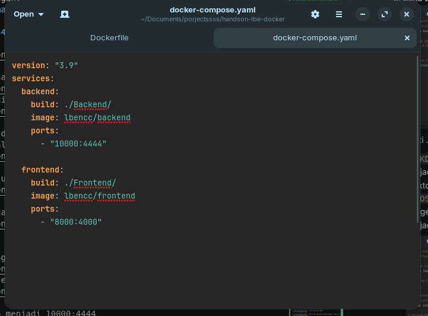

- jalankan image dengan `docker compose up` \
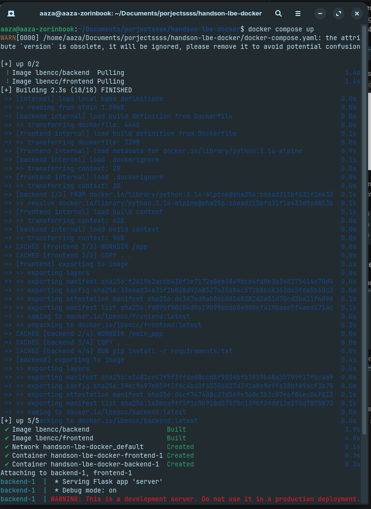

- akses `localhost:8000` di web kalian, lalu coba daftarkan sebuah nama terserah \
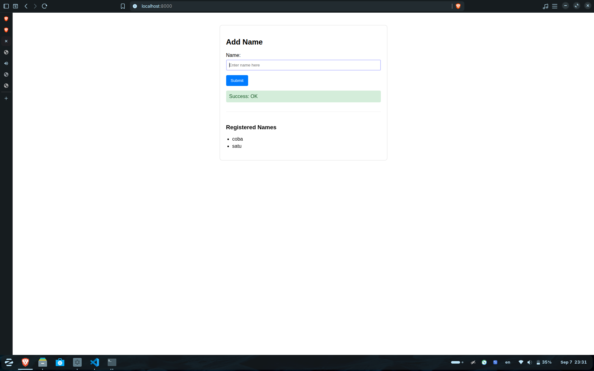

- gunakan `docker compose down` untuk menghentikan dan menghapus container \
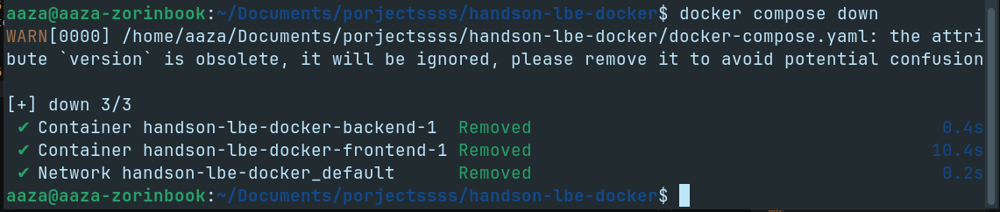
**note:** gunakan `docker compose down --rmi all` untuk menghentikan dan menghapus container dan imagenya


### challenge (kalau waktunya cukup)
Aku akan membagikan file `challenge.py` \
Buat Dockerfile yang bisa ngebuild challenge.py tersebut \
note & hint:
- gunakan base image python versi  3.12.13
- gunakan direktori `/hahaha`
- urutan dockerfile sama dengan Dockerfile yang sudah diajarkan sebelumnya
- untuk command `RUN`, gunakan `RUN pip install flask`
- port yang diekspos adalah port 5000
- jalankan container dan buat agar webnya bisa diakses dari port 8888


