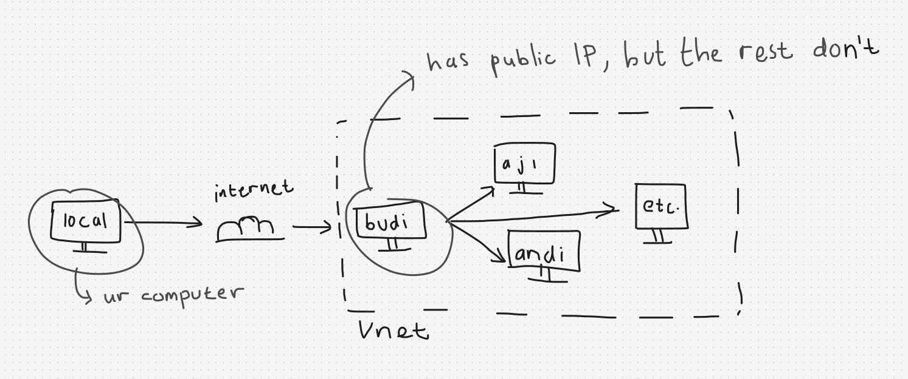

# Load Balancer Demo — Offline Docker Setup (4 VMs, 1 Public IP)

## Why this guide exists

Normally you'd install Docker on every VM the easy way — the online method in
[`INSTALL.md`](https://raw.githubusercontent.com/ncclaboratory18/lbe-2026/refs/heads/main/module-3/breakout-lb-demo/INSTALL.md),
using `install-docker.sh`, which needs internet access on that VM.

For this event, our shared resource group only allows **2 public IP
addresses**. The load balancer takes one. That leaves exactly **one VM**
with a public IP — call it the **master VM**. The other three VMs sit in
the same VNet/subnet with no internet access at all.



So the plan is:

1. **`budi`** (master) has internet → install Docker normally, clone the
   repo, build the image.
2. **`budi`** has no internet route to `aji`/`andi`/`etc.` from your
   laptop directly — but `budi` itself *can* reach them, because they're
   all in the same VNet. So `budi` becomes your jump box.
3. Docker on the offline VMs (`aji`, `andi`, `etc.`) gets installed from
   `.deb` files downloaded on `budi` and copied over with `scp` — no
   internet needed on those three.
4. The image gets built once on `budi`, saved to a `.tar` file, and copied
   to the other three with `scp`, then loaded there — so nobody else needs
   to `docker build`.
5. Every VM runs the container with its own hostname baked in via
   `-e VM_HOSTNAME=$(hostname)`, exactly like the normal INSTALL.md flow —
   so the demo still shows "who answered this request" correctly.

You will run every command yourself, one at a time, so you understand what
each one is doing. Nothing here is a script you just execute blindly.

---

## Before you start

You need, from whoever set up the VMs:

- SSH access to `budi` (the master VM), e.g. `ssh <user>@<budi_public_ip>`
- The **private IP addresses** (not public — they don't have one) of
  `aji`, `andi`, and `etc.` inside the VNet. Ask your instructor, or once
  you're on `budi` you can often find them from the Azure Portal's VM
  overview page.
- The same SSH key or credentials should work for all 4 VMs, since they
  were provisioned together for this event — confirm with your instructor
  if unsure.

Throughout this guide:
- `<budi_public_ip>` = the one public IP you were given
- `<username>` = your VM login username (same across all 4 VMs)
- `<aji_ip>`, `<andi_ip>`, `<etc_ip>` = private IPs of the other 3 VMs

---

## Part 1 — Set up the master VM (`budi`)

### 1.1 SSH into budi

From your laptop:

```bash
ssh <username>@<budi_public_ip>
```

You're now on `budi`. Everything in Part 1 happens here.

### 1.2 Install Docker the normal (online) way

`budi` has internet, so use the same install script the rest of the class
uses. First, clone the repo:

```bash
git clone https://github.com/ncclaboratory18/lbe-2026.git
cd lbe-2026/module-3/breakout-lb-demo
```

Then install Docker:

```bash
chmod +x install-docker.sh
sudo ./install-docker.sh
```

If you hit this error later when running `docker` commands:

```
permission denied while trying to connect to the docker API at unix:///var/run/docker.sock
```

run:

```bash
sudo usermod -aG docker $USER
newgrp docker
```

Confirm Docker is working:

```bash
docker version
```

### 1.3 Build the image on budi

Still inside `~/lbe-2026/module-3/breakout-lb-demo`:

```bash
docker build -t breakout-lb-demo .
```

This may take a minute the first time as it pulls base layers from the
internet — this is the *only* VM where that internet-dependent step
happens.

### 1.4 Run the container on budi itself

`budi` is also one of the 4 backends in this demo, so it runs the
container too:

```bash
docker run -d --name breakout -p 8080:8080 -e VM_HOSTNAME=$(hostname) breakout-lb-demo
```

Check the logs:

```bash
docker logs breakout
```

You should see something like:

```
Starting Breakout LB demo, hostname injected as: budi
```

### 1.5 Open port 8080 on budi's NSG

In the Azure Portal, go to `budi`'s Networking page and add an inbound
rule allowing TCP port 8080, if it isn't already open.

### 1.6 Verify budi from your own laptop

Open a **new terminal on your laptop** (don't close your SSH session to
budi, you'll need it):

```bash
curl -s http://<budi_public_ip>:8080/ | head -5
```

You should get HTML back, and the hostname shown should say `budi`.

---

## Part 2 — Download Docker's offline installer files (still on budi)

Go back to your SSH session on `budi`. You'll now prepare the `.deb`
packages that `aji`, `andi`, and `etc.` need, since they have no internet
to download these themselves.

### 2.1 Add Docker's official APT repository (if not already present)

```bash
sudo apt-get update
sudo apt-get install -y ca-certificates curl gnupg
sudo install -m 0755 -d /etc/apt/keyrings
curl -fsSL https://download.docker.com/linux/ubuntu/gpg | sudo gpg --dearmor -o /etc/apt/keyrings/docker.gpg
sudo chmod a+r /etc/apt/keyrings/docker.gpg

echo \
  "deb [arch=$(dpkg --print-architecture) signed-by=/etc/apt/keyrings/docker.gpg] https://download.docker.com/linux/ubuntu \
  $(. /etc/os-release && echo $VERSION_CODENAME) stable" | \
  sudo tee /etc/apt/sources.list.d/docker.list > /dev/null

sudo apt-get update
```

> `install-docker.sh` from step 1.2 may have already done some or all of
> this. Running it again is harmless — `apt-get update` just refreshes.

### 2.2 Download the .deb packages (don't install — just download)

```bash
mkdir -p ~/docker-offline-debs
sudo apt-get clean
sudo apt-get install -y --download-only \
  docker-ce docker-ce-cli containerd.io docker-buildx-plugin docker-compose-plugin
cp /var/cache/apt/archives/*.deb ~/docker-offline-debs/
```

Check what you got:

```bash
ls ~/docker-offline-debs
```

You should see around 6–8 `.deb` files, including `docker-ce`,
`docker-ce-cli`, `containerd.io`, `docker-buildx-plugin`,
`docker-compose-plugin`, and small dependencies like `pigz`.

`--download-only` guarantees apt resolves and downloads the *complete*
dependency tree for you — no need to hunt down each dependency by hand.

---

## Part 3 — Save the built image to a file (still on budi)

The other 3 VMs don't need to build the image themselves (they have no
internet to pull base layers anyway) — they just need the final image
that `budi` already built.

```bash
docker save breakout-lb-demo -o ~/breakout-lb-demo.tar
ls -lh ~/breakout-lb-demo.tar
```

This `.tar` file contains the complete image, ready to be loaded on any
other Docker host with `docker load`.

---

## Part 4 — Copy everything from budi to the other 3 VMs

Still on `budi`, `scp` the `.deb` files and the saved image to each of
`aji`, `andi`, and `etc.` in turn. Repeat this whole block 3 times,
substituting the right IP each time.

### 4.1 Copy to aji

```bash
scp ~/docker-offline-debs/*.deb <username>@<aji_ip>:~/docker-offline-debs/
```

If that fails because the remote folder doesn't exist yet, create it
first:

```bash
ssh <username>@<aji_ip> "mkdir -p ~/docker-offline-debs"
scp ~/docker-offline-debs/*.deb <username>@<aji_ip>:~/docker-offline-debs/
scp ~/breakout-lb-demo.tar <username>@<aji_ip>:~/
```

### 4.2 Copy to andi

```bash
ssh <username>@<andi_ip> "mkdir -p ~/docker-offline-debs"
scp ~/docker-offline-debs/*.deb <username>@<andi_ip>:~/docker-offline-debs/
scp ~/breakout-lb-demo.tar <username>@<andi_ip>:~/
```

### 4.3 Copy to etc

```bash
ssh <username>@<etc_ip> "mkdir -p ~/docker-offline-debs"
scp ~/docker-offline-debs/*.deb <username>@<etc_ip>:~/docker-offline-debs/
scp ~/breakout-lb-demo.tar <username>@<etc_ip>:~/
```

> Because `aji`, `andi`, and `etc.` have no public IP, this `scp` only
> works *from `budi`*, since `budi` is on the same VNet/subnet as them.
> You cannot `scp` directly from your laptop to these three — your laptop
> can only reach `budi`.

---

## Part 5 — Install Docker offline on each of the 3 VMs

Repeat this entire part on `aji`, `andi`, and `etc.` — one VM at a time.
You can either SSH to each directly from your laptop if your network
allows routing into the VNet, or (more likely) SSH into `budi` first and
then SSH onward from there:

```bash
ssh <username>@<budi_public_ip>
ssh <username>@<aji_ip>
```

### 5.1 Install Docker from the local .deb files

Once you're on `aji` (or `andi`, or `etc.`):

```bash
cd ~/docker-offline-debs
sudo dpkg -i *.deb
```

If `dpkg` complains about missing dependencies, it means a package was
missed in step 2.2 — since this VM has no internet, `apt-get install -f`
won't be able to fix it automatically. Go back to `budi`, check
`ls ~/docker-offline-debs`, and re-copy anything missing.

### 5.2 Start the Docker service

```bash
sudo systemctl enable --now docker
```

### 5.3 Fix permissions if needed

```bash
sudo usermod -aG docker $USER
newgrp docker
```

### 5.4 Verify Docker is installed

```bash
docker version
```

---

## Part 6 — Load and run the image on each of the 3 VMs

Still on the same VM (`aji`, `andi`, or `etc.`):

### 6.1 Load the image from the tar file

```bash
docker load -i ~/breakout-lb-demo.tar
```

Confirm it's there:

```bash
docker images
```

You should see `breakout-lb-demo` listed.

### 6.2 Run the container

Same command as on `budi` — this is the important part, since
`$(hostname)` picks up *this* VM's own hostname automatically:

```bash
docker run -d --name breakout -p 8080:8080 -e VM_HOSTNAME=$(hostname) breakout-lb-demo
```

### 6.3 Check the logs

```bash
docker logs breakout
```

Confirm the hostname shown matches the VM you're on, e.g.:

```
Starting Breakout LB demo, hostname injected as: aji
```

### 6.4 Open port 8080 on this VM's NSG

Even though `aji`/`andi`/`etc.` have no public IP, the load balancer
still needs to reach them over the VNet on port 8080. In the Azure
Portal, go to this VM's Networking page and add an inbound rule allowing
TCP port 8080 from the VNet (or from "Any" if that's how your NSGs are
already configured for the other VMs in this class).

### 6.5 Verify from budi (not from your laptop — this VM has no public IP)

Since you can't reach `aji`/`andi`/`etc.` directly from your laptop, test
from `budi` instead, which is on the same VNet:

```bash
curl -s http://<aji_ip>:8080/ | head -5
```

You should get HTML back with `aji`'s hostname in it.

---

## Part 7 — Repeat Part 5 and 6 for the remaining VMs

Once one of `aji`/`andi`/`etc.` is confirmed working, repeat Parts 5 and 6
exactly the same way for the next VM, then the last one. By the end, all
4 VMs (`budi`, `aji`, `andi`, `etc.`) should each be running the
container and each report their own distinct hostname when curled.

---

## Part 8 — Set up the load balancer

This part is identical to the normal flow in `INSTALL.md`:

- **Backend pool:** add all 4 VMs (`budi`, `aji`, `andi`, `etc.`) — note
  that only `budi` has a public IP, but the load balancer talks to
  backends over their *private* IPs anyway, so this works fine for all 4.
- **Health probe:** HTTP, port 8080, path `/`.
- **Load balancing rule:** frontend port 8080 → backend port 8080,
  session persistence set to **None**.

## Part 9 — Prove it's load balancing

Point your browser at the load balancer's public IP on port 8080 and
refresh repeatedly:

```
http://<load_balancer_public_ip>:8080
```

The hostname shown on screen should rotate between `budi`, `aji`,
`andi`, and `etc.` as the load balancer distributes requests — even
though 3 of those 4 machines have never had a public IP or direct
internet access at any point in this setup.

---

## Troubleshooting quick reference

| Problem | Likely cause / fix |
|---|---|
| `dpkg -i *.deb` fails with dependency errors | A `.deb` was missed in step 2.2 or not copied in Part 4 — re-check `ls ~/docker-offline-debs` on both `budi` and the target VM |
| `permission denied ... docker.sock` | Run `sudo usermod -aG docker $USER && newgrp docker` on that VM |
| `curl` from your laptop to `aji`/`andi`/`etc.` hangs or fails | Expected — they have no public IP. Curl from `budi` instead |
| Hostname shown is `unknown` | `$(hostname)` didn't resolve in that shell — run plain `hostname` on its own first to confirm it returns something |
| `scp` to `aji`/`andi`/`etc.` fails from your laptop | Expected — only `budi` is reachable from outside the VNet. Always `scp`/`ssh` to these three *from budi* |