> **NOTE: This Bahasa Indonesia version is translated by AI. Some words might sound a bit weird/odd. Consider reading the original document in [README_EN.md](./README_EN.md) instead.**

# Modul 3: Load Balancing dengan Azure

## Lab Based Education, Pertemuan 3

---

Youtube Tutorial (No Talk): https://www.youtube.com/watch?v=CXm_ydM4YLM

## 1. Gambaran Umum

Modul ini menggabungkan semua hal dari Pertemuan 1 (Azure) dan Pertemuan 2 (Docker). Setiap anggota tim memiliki mesin virtual (VM) masing-masing yang menjalankan aplikasi web berbasis Docker. Pada sesi ini, tim akan menempatkan VM tersebut di belakang satu Azure Load Balancer dan membuktikan bahwa lalu lintas (traffic) didistribusikan ke semuanya.

Pada akhir modul ini, setiap tim akan memiliki pengaturan bersama yang berfungsi dan menjadi dasar untuk proyek akhir mereka.

---

## 2. Tujuan Pembelajaran

Pada akhir sesi ini, peserta akan dapat:

1. Menjelaskan fungsi load balancer dan mengapa itu penting untuk ketersediaan (availability) dan skalabilitas (scaling).
2. Menyiapkan lingkungan Azure bersama agar beberapa anggota tim dapat bekerja bersama.
3. Mengonfigurasi Network Security Group (NSG) untuk mengizinkan lalu lintas yang tepat.
4. Membuat Standard Azure Load Balancer dengan backend pool, health probe, dan aturan load balancing.
5. Membuktikan, dengan bukti, bahwa permintaan didistribusikan ke beberapa mesin virtual di backend.
6. Mengamati bagaimana load balancer bereaksi ketika salah satu instance backend menjadi tidak sehat (unhealthy).

---

## 3. Sebelum Memulai: Daftar Periksa Prasyarat

Setiap peserta harus memastikan hal-hal berikut sebelum sesi ini dimulai. Jika ada item yang belum terpenuhi, selesaikan sebelum sesi dimulai, karena seluruh modul ini bergantung padanya.

- [ ] Langganan Azure for Students yang aktif (Pertemuan 1)
- [ ] Terbiasa membuat VM dan terhubung ke sana menggunakan SSH (Pertemuan 1)
- [ ] Docker sudah terinstal dan berfungsi, baik secara lokal maupun di VM mereka (Pertemuan 2)
- [ ] File aplikasi Breakout LB Demo yang disediakan di lab tersedia (folder `Dockerfile`, `entrypoint.sh`, `nginx.conf`, `app/`) (Pertemuan 2)
- [ ] Aplikasi telah di-build menjadi image Docker dan berhasil dijalankan setidaknya sekali, dengan browser yang mengonfirmasi bahwa layar menampilkan hostname VM yang benar (Pertemuan 2)
- [ ] Setiap peserta mengetahui alamat IP publik VM mereka sendiri dan lokasi kunci SSH-nya

---

## 4. Catatan Penting Mengenai Jenis Load Balancer

Azure dulunya menawarkan Load Balancer "Basic" yang gratis. SKU tersebut telah dipensiunkan pada 30 September 2025, dan tidak dapat lagi dibuat. Panduan ini menggunakan **Standard Load Balancer**, yang merupakan satu-satunya opsi yang tersedia saat ini.

Dua hal penting yang harus diketahui peserta sebelum memulai:

1. **Tidak gratis.** Ada biaya per jam yang kecil ditambah biaya pemrosesan data. Kredit Azure for Students akan menutupi ini untuk sesi lokakarya singkat, tetapi semua orang harus membersihkan sumber daya setelahnya (lihat Bagian 16).
2. **Tertutup secara default.** Berbeda dengan Basic Load Balancer yang lama, Standard Load Balancer dan VM di belakangnya tidak akan menerima lalu lintas masuk apa pun kecuali Network Security Group (NSG) secara eksplisit mengizinkannya. Bagian 11 dari panduan ini membahas langkah ini. Melewatkan langkah ini adalah alasan paling umum mengapa load balancer "tidak berfungsi."

---

## 5. Konsep Kunci (Versi Singkat)

Buat bagian ini tetap singkat saat presentasi langsung. Gunakan istilah-istilah di bawah ini saat muncul pada langkah praktik langsung daripada menjelaskannya semua di awal.

- **Load balancer**: titik masuk tunggal yang menerima lalu lintas dan meneruskannya ke salah satu dari beberapa server backend.
- **Frontend IP**: alamat IP publik yang digunakan klien untuk terhubung. Ini adalah alamat load balancer, bukan alamat VM mana pun.
- **Backend pool**: kelompok VM yang akan menerima lalu lintas dari load balancer.
- **Health probe**: pemeriksaan berkala yang dijalankan load balancer terhadap setiap VM backend untuk memutuskan apakah VM tersebut cukup sehat untuk menerima lalu lintas.
- **Load balancing rule (Aturan load balancing)**: konfigurasi yang menghubungkan port frontend ke port backend, menggunakan backend pool dan health probe tertentu.
- **Network Security Group (NSG)**: firewall yang terpasang pada antarmuka jaringan (network interface) VM atau subnet. Standard Load Balancer memerlukan aturan NSG untuk mengizinkan lalu lintas masuk.

---

## 6. Aplikasi yang Digunakan di Panduan Ini: Breakout LB Demo

Modul ini menggunakan aplikasi demo khusus, bukan aplikasi sementara yang umum: game Breakout yang dapat dimainkan, di mana dinding blok mengeja nama host (hostname) VM itu sendiri. Ini adalah situs statis (HTML, CSS, JavaScript) yang disajikan oleh nginx di dalam satu kontainer Docker, tanpa database, tanpa layanan backend.

Nilai-nilai di bawah ini tetap (fixed) untuk aplikasi ini dan digunakan secara konsisten di seluruh panduan ini.

| Item | Nilai |
|---|---|
| Nama image kontainer | `breakout-lb-demo` |
| Port (di dalam kontainer dan dipublikasikan di setiap host VM) | `8080` |
| Port menghadap publik dari load balancer | `80` (sehingga peserta dapat mengunjungi `http://<public-ip>` tanpa nomor port; load balancer meneruskan secara internal ke port 8080 di VM mana pun yang dipilihnya, lihat Bagian 12.5) |
| Path health check | `/` (mengembalikan HTTP 200 secara konsisten, tidak perlu login atau state) |
| Pengenal instance (Instance identifier) | Hostname VM itu sendiri, dieja di dinding blok dan ditampilkan sebagai teks biasa di atas kanvas |
| Cara pengenal instance diatur | Variabel lingkungan (environment variable) `VM_HOSTNAME` diteruskan pada saat `docker run` menggunakan `$(whoami)`. Skrip `entrypoint.sh` pada kontainer menuliskannya ke dalam file `config.js` yang dihasilkan sebelum nginx dimulai, sehingga image yang sama akan menampilkan hostname yang berbeda di setiap VM |
| Sistem operasi VM | Ubuntu 22.04 LTS (atau versi LTS terbaru yang tersedia di portal) |
| Ukuran VM | `Standard_B1s` (memenuhi syarat tingkat gratis (free tier), cukup untuk aplikasi ini karena ini adalah situs statis ringan tanpa database) |
| Region | Southeast Asia, atau region terdekat dengan lokasi Anda |

Karena hostname disertakan pada saat kontainer dimulai (startup) alih-alih pada saat image di-build, image yang sama persis dapat berjalan tanpa modifikasi di setiap VM anggota tim dan tetap dapat mengidentifikasi dengan benar VM mana yang menjawab permintaan. Inilah yang membuat pembuktian load balancer di Bagian 13 menjadi mudah: Anda tidak perlu menebak apakah dua respons berasal dari VM yang berbeda, aplikasi langsung memberi tahu Anda.

---

## 7. Bagian 0: Penyiapan Lingkungan Tim

Langkah ini penting karena setiap peserta kemungkinan besar membuat VM mereka sendiri di bawah langganan Azure for Students pribadi mereka selama Pertemuan 1 dan 2. Backend pool load balancer hanya dapat mencakup VM yang berada di virtual network (VNet) yang sama dengan load balancer itu sendiri. Tiga langganan pribadi yang terpisah berarti ada tiga virtual network yang terpisah secara default, dan itu tidak akan berfungsi.

### Resource group bersama di bawah langganan salah satu anggota tim (direkomendasikan)

Penting: di Azure, penagihan selalu mengikuti langganan, bukan orang yang membuat sumber daya. Ini berarti setiap VM, IP publik, dan load balancer yang dibuat di dalam resource group Pemilik Tim (Team Owner) ditagih pada saldo kredit Azure for Students milik Pemilik Tim, meskipun rekan satu tim yang mengklik "Create" (Buat) menggunakan login mereka sendiri dengan akses Contributor. Rekan tim tidak membayar secara individu untuk sumber daya yang dibuat dengan cara ini.

Pastikan tim menyadari hal ini sebelum memilih Pemilik Tim, dan sepakati sebagai tim tentang cara menjaga penggunaan yang adil, misalnya bergantian menjadi Pemilik Tim di modul yang berbeda, atau semua orang setuju untuk melakukan deallocate pada VM segera setelah setiap sesi agar kredit bersama bertahan hingga proyek akhir. Jika ada anggota yang merasa tidak nyaman menjadi satu-satunya penanggung biaya untuk seluruh tim, tinjau kembali keputusan ini sebelum melanjutkan.

1. Sebagai sebuah tim, pilih salah satu anggota untuk menjadi **Pemilik Tim (Team Owner)**. Langganan Azure mereka akan menampung semua sumber daya bersama untuk modul ini dan proyek akhir, dan saldo kredit merekalah yang akan digunakan.
2. Pemilik Tim masuk ke Portal Azure dan membuat **Resource Group** baru untuk tim, contohnya `rg-team01-lbe`.
   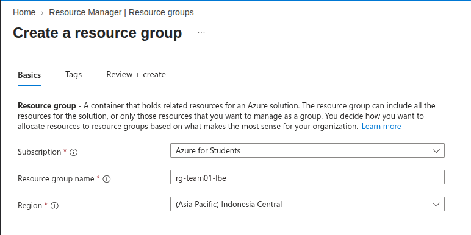
3. Pemilik Tim membuka resource group baru tersebut, memilih **Access control (IAM)** dari menu sebelah kiri, lalu memilih **Add role assignment**.
   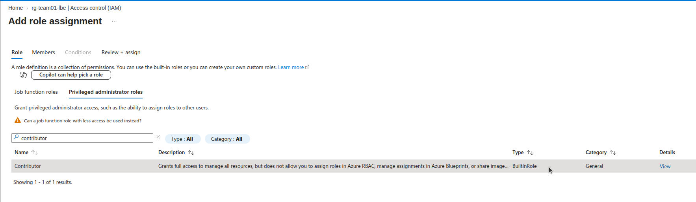
4. Pemilik Tim menetapkan peran **Contributor** kepada setiap rekan tim, menggunakan alamat email yang terkait dengan akun Azure for Students mereka.
   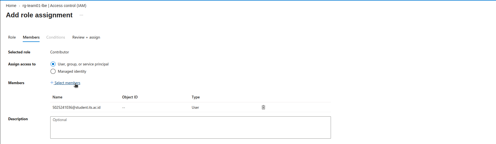
   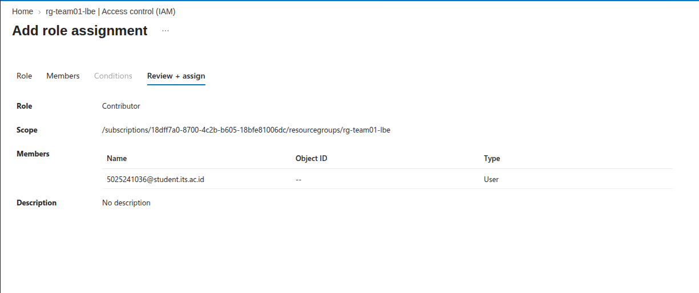
5. Setiap rekan tim memeriksa email mereka untuk melihat undangan (jika akun berada di tenant Azure AD yang berbeda) dan menerimanya. Setelah diterima, mereka dapat beralih ke direktori Pemilik Tim dari menu akun Portal Azure dan melihat resource group bersama.
6. Sebelum rekan tim mana pun mencoba membuat VM, **Pemilik Tim** (bukan rekan tim) harus mendaftarkan resource provider yang dibutuhkan modul ini, karena hal ini memerlukan izin pada tingkat langganan (subscription level) dan akses Contributor pada resource group saja tidak cukup. Saat masuk sebagai Pemilik Tim, buka **Subscriptions**, pilih langganan yang sedang digunakan, pilih **Settings > Resource providers**, cari `Microsoft.Compute` dan `Microsoft.Storage`, lalu pilih **Register** untuk masing-masing jika tampilannya belum terdaftar (unregistered). Ini adalah langkah yang cukup dilakukan satu kali per langganan.
7. Sejak saat ini dan seterusnya, setiap sumber daya untuk modul ini (virtual network, VM, load balancer) akan dibuat di dalam satu resource group bersama ini, meskipun setiap rekan tim membuat VM mereka sendiri menggunakan login mereka sendiri.

Jika rekan tim mencoba membuat VM sebelum langkah ini dan melihat pesan kesalahan (error) yang menyebutkan bahwa resource provider tidak terdaftar dan mereka tidak memiliki izin untuk mendaftarkannya, ini adalah hal yang wajar. Ini berarti langkah 6 belum diselesaikan oleh Pemilik Tim. Ini bukan tanda bahwa ada hal lain yang salah dikonfigurasi.

Jika organisasi Anda sudah menyediakan langganan kelas bersama atau tenant Azure AD bersama untuk workshop ini, lewati langkah 2 hingga 5 dan cukup pastikan semua orang memiliki akses Contributor ke satu resource group bersama di sana.

---

## 8. Bagian 1: Menyiapkan Virtual Network Bersama

1. Di dalam resource group bersama, cari **Virtual networks** dan pilih **Create**.
2. Konfigurasikan hal berikut pada tab Basics:
   - Resource group: resource group bersama milik tim dari Bagian 0
   - Name (Nama): misalnya `vnet-team01`
   - Region: region yang sama untuk semua sumber daya di modul ini

   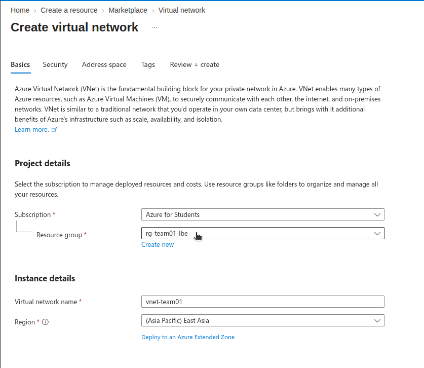

3. Pilih **Review + create**, lalu **Create**.

Setiap VM yang dibuat untuk modul ini harus menggunakan virtual network ini dan subnet yang sama di dalamnya.

---

## 9. Bagian 2: Setiap Anggota Membuat Mesin Virtual (VM)

Setiap rekan tim mengulangi langkah ini secara individual, menggunakan sesi Portal Azure mereka sendiri, tetapi membuat VM di dalam resource group bersama dan virtual network bersama dari Bagian 1.

### 9.0 Buat Pasangan Kunci SSH Anda Terlebih Dahulu

Lakukan ini di laptop Anda sendiri, sebelum menyentuh Portal Azure, bukan di VM (VM-nya belum ada).

Pasangan kunci (key pair) SSH adalah dua file yang bekerja sama: kunci privat (private key), yang tetap berada di laptop Anda dan tidak boleh dibagikan, serta kunci publik (public key), yang aman untuk diberikan kepada siapa pun, termasuk Azure, karena hanya dapat digunakan untuk memverifikasi Anda, bukan untuk menyamar sebagai Anda. Azure dapat menghasilkan pasangan ini untuk Anda secara otomatis selama pembuatan VM, tetapi membuatnya sendiri terlebih dahulu akan memberi Anda kunci yang Anda kontrol, pahami, dan dapat digunakan kembali secara rapi (cleanly) di setiap VM yang Anda buat di modul ini.

1. Buka terminal (WSL, Terminal macOS, atau Linux) dan jalankan:
   ```bash
   ssh-keygen -t ed25519 -C "team01-<nama_anda>" -f ~/.ssh/lbe_team01_key
   ```
   - `-t ed25519` memilih jenis kunci yang modern dan cepat. Jika sistem Anda terlalu lama sehingga tidak mendukung ed25519, gunakan `-t rsa -b 4096` sebagai gantinya.
   - `-C` hanyalah label (komentar) yang dilampirkan pada kunci, berguna untuk membedakan beberapa kunci nanti. Ganti `<nama_anda>` dengan nama Anda sendiri, misalnya `team01-danish`.
   - `-f ~/.ssh/lbe_team01_key` menetapkan nama file tertentu untuk kunci ini, alih-alih menimpa kunci default yang mungkin sudah Anda miliki (`~/.ssh/id_ed25519`).
2. Anda akan dimintai kata sandi (passphrase). Untuk sesi workshop singkat, menekan Enter dua kali agar kosong dapat diterima. Untuk sesuatu yang ingin Anda terus gunakan setelahnya, tetapkan kata sandi (passphrase) yang nyata, karena kata sandi yang kosong berarti siapa saja yang mendapatkan salinan file kunci privat Anda dapat menggunakannya secara langsung.
3. Ini menghasilkan dua file:
   - `~/.ssh/lbe_team01_key` (kunci privat, simpan ini di laptop Anda saja)
   - `~/.ssh/lbe_team01_key.pub` (kunci publik, aman untuk di-paste ke Azure)
4. Kunci izin (permissions) kunci privat, yang diwajibkan oleh SSH agar dapat menggunakannya:
   ```bash
   chmod 600 ~/.ssh/lbe_team01_key
   ```
5. Cetak kunci publik sehingga Anda dapat menyalinnya:
   ```bash
   cat ~/.ssh/lbe_team01_key.pub
   ```
   Salin seluruh output, termasuk awalan `ssh-ed25519` di awal dan komentar di akhir. Anda akan menyalin (paste) ini ke Portal Azure di langkah berikutnya.

### 9.1 Buat VM

1. Cari **Virtual machines** dan pilih **Create > Azure virtual machine**.
2. Pada tab Basics:
   - Resource group: resource group bersama milik tim
   - Virtual machine name: sesuatu yang dapat diidentifikasi per orang, misalnya `budi` atau `danish`
   - Region: sama seperti virtual network bersama
   - Image: Ubuntu Server 22.04 LTS (atau versi LTS saat ini yang ditawarkan)
   - Size: `Standard_B1s` atau ukuran sejenis yang memenuhi syarat tingkat gratis (free tier)
   - Authentication type: SSH public key
   - Username: pilihan Anda, catat untuk nanti
   - SSH public key source: **Use existing public key**
   - SSH public key: salin seluruh isi yang Anda salin dengan `cat` pada langkah 9.0.5
   
   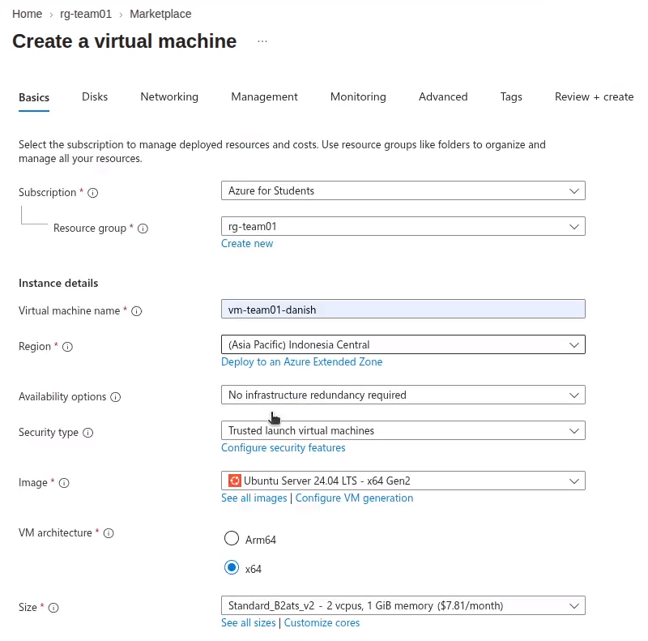 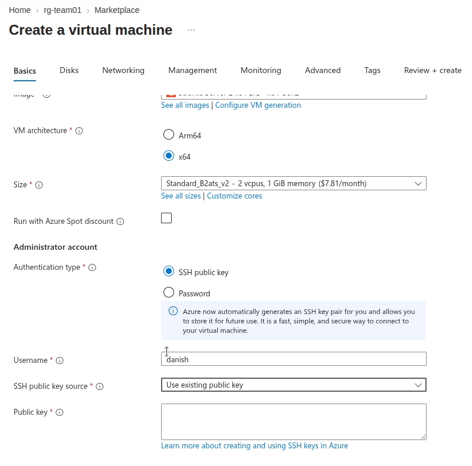 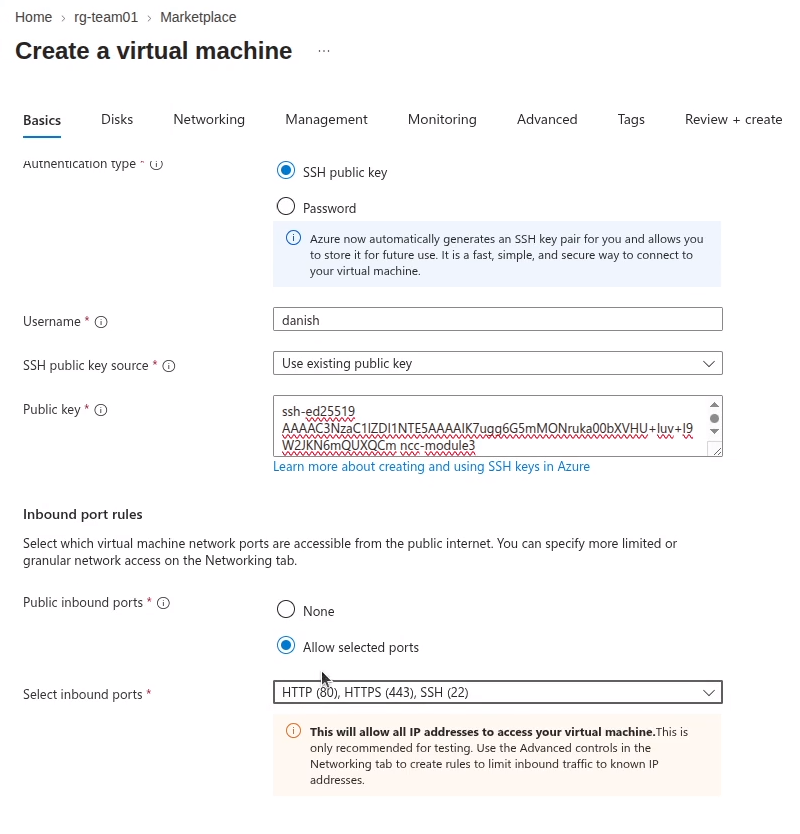
3. Pada tab Networking:
   - Virtual network: pilih `vnet-team01` bersama yang dibuat di Bagian 1
   - Subnet: subnet di dalam virtual network tersebut
   - Public IP: buat yang baru, SKU Standard
   - NIC network security group: pilih **None** untuk saat ini, atau Basic. Kita akan mengonfigurasi aturan NSG secara eksplisit di Bagian 4 alih-alih mengandalkan default di sini.
   
   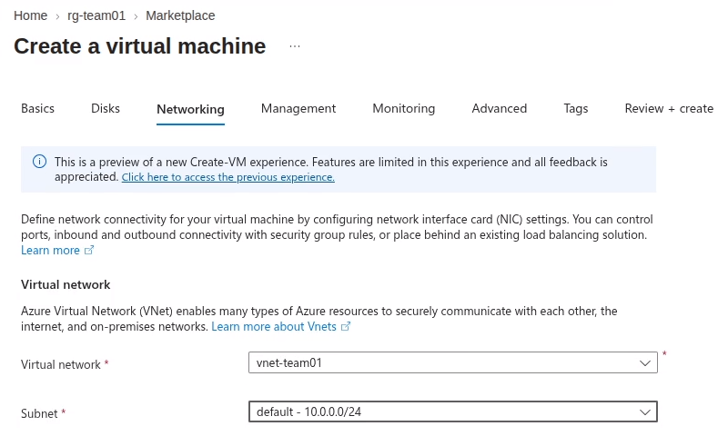
   
4. Pilih **Review + create**, tinjau pengaturan, lalu **Create**. Karena Anda memberikan kunci publik Anda sendiri, kali ini tidak ada file kunci privat yang dapat diunduh, Anda sudah memilikinya di laptop Anda dari langkah 9.0.
5. Setelah penerapan (deployment) selesai, catat alamat IP publik VM.
6. Hubungkan menggunakan file kunci privat spesifik yang Anda buat, bukan yang default:
   ```bash
   ssh -i ~/.ssh/lbe_team01_key <username>@<ip_publik_vm_anda>
   ```

Ulangi ini untuk setiap anggota tim. Di akhir bagian ini, tim akan memiliki 2 atau 3 VM, semuanya berada di dalam resource group yang sama dan virtual network yang sama, masing-masing dengan IP publiknya sendiri.

---

## 10. Bagian 3: Verifikasi Aplikasi Berjalan di Setiap VM

Setiap rekan tim melakukan ini pada VM mereka sendiri.

1. Terhubung (connect) melalui SSH, menggunakan file kunci spesifik yang dibuat di Bagian 2:
   ```bash
   ssh -i ~/.ssh/lbe_team01_key <username>@<ip_publik_vm_anda>
   ```
2. Pastikan Docker sudah terinstal dan berjalan:
   ```bash
   docker --version
   sudo systemctl status docker
   ```
3. Salin folder proyek Breakout LB Demo ke VM ini (menggunakan `scp` dari mesin lokal Anda, atau kloning (clone) jika berada di repo), lalu build image:
   ```bash
   cd breakout-lb-demo
   docker build -t breakout-lb-demo .
   ```
4. Jalankan kontainer. Bagian `-e VM_HOSTNAME=$(whoami)` bukan opsional, bagian inilah yang membuat VM spesifik ini menampilkan hostnamenya sendiri alih-alih placeholder umum:
   ```bash
   docker run -d --name breakout -p 8080:8080 -e VM_HOSTNAME=$(whoami) breakout-lb-demo
   ```
5. Konfirmasi bahwa hostname benar-benar ditangkap (picked up), sebelum melakukan hal lain:
   ```bash
   docker logs breakout
   ```
   Anda akan melihat baris seperti `Starting Breakout LB demo, hostname injected as: danish`. Jika muncul tulisan `unknown`, jalankan perintah `whoami` biasa di VM tersebut untuk memastikan subtitusi shell memiliki nilai untuk dikerjakan.
6. Dari dalam sesi SSH, pastikan aplikasi merespons secara lokal di VM:
   ```bash
   curl -s http://localhost:8080/config.js
   ```
   Ini akan mengembalikan sesuatu seperti `window.APP_CONFIG = { hostname: "danish" };`. Ini adalah pemeriksaan yang lebih berguna daripada menggunakan `curl` pada halaman HTML lengkap, karena ini mengisolasi dengan tepat nilai yang penting untuk membuktikan load balancing nantinya.
7. Dari browser atau terminal mesin Anda sendiri (bukan dari dalam sesi SSH), coba:
   ```bash
   curl http://<ip_publik_vm_anda>:8080/config.js
   ```
   Pada titik ini, perintah tersebut akan gagal atau macet (hang) jika belum ada aturan NSG yang mengizinkan port 8080. Itu sudah diduga (expected), langkah ini hanya memastikan kontainer itu sendiri berjalan dengan benar di VM.

Pos Pemeriksaan (Checkpoint): setiap rekan tim mengonfirmasi, di dalam sesi SSH mereka sendiri, bahwa `curl http://localhost:8080/config.js` mengembalikan hostname VM mereka yang sebenarnya, bukan `unknown` dan bukan nama VM lain.

---

## 11. Bagian 4: Mengonfigurasi Aturan Network Security Group (NSG)

Langkah ini diperlukan karena Standard Load Balancer memblokir semua lalu lintas masuk secara default. Tanpa langkah ini, health probe akan selalu gagal dan load balancer akan menampilkan setiap backend sebagai tidak sehat (unhealthy).

Lakukan ini sekali per VM, karena setiap VM memiliki antarmuka jaringannya (network interface) sendiri.

1. Buka halaman resource VM di Portal Azure.
2. Pilih **Networking** dari menu sebelah kiri.
3. Pilih **Add inbound port rule**.
   
   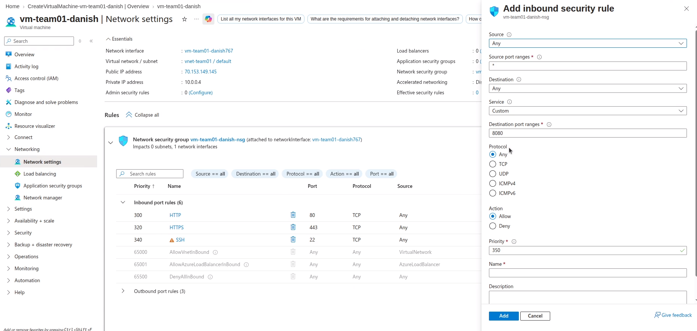
   
4. Konfigurasikan aturan (rule):
   - Source: Any (atau batasi nanti jika Anda ingin mempraktikkan pengetatan keamanan)
   - Source port ranges: `*`
   - Destination: Any
   - Destination port ranges: `8080`
   - Protocol: TCP
   - Action: Allow
   - Priority: nilai apa pun yang belum digunakan, contohnya `320`
   - Name: `Allow-App-Port`
   
   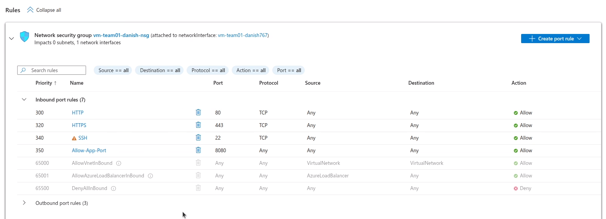

5. Pilih **Add**.
6. Ulangi langkah 1 hingga 5 untuk setiap VM dalam tim.

Setelah ini, jalankan ulang pengujian `curl http://<ip_publik_vm_anda>:8080/config.js` dari Bagian 3 di mesin Anda sendiri. Sekarang pengujian ini akan berhasil untuk setiap VM secara individual, dan mengembalikan hostname VM spesifik tersebut. Konfirmasi hal ini sebelum melanjutkan, karena penyiapan load balancer akan lebih sulit di-debug (di-troubleshoot) jika VM individual tersebut belum dapat dijangkau.

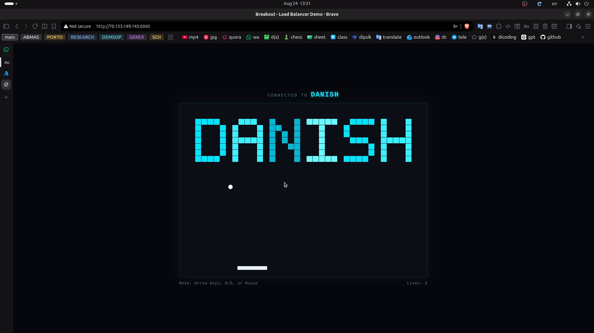

---

## 12. Bagian 5: Membuat Load Balancer

Satu anggota tim melakukan bagian ini sementara yang lain menonton dan mengikuti, karena hanya satu load balancer yang dibutuhkan per tim. Semua orang harus tetap login ke resource group bersama untuk melihat prosesnya secara langsung (live) jika bekerja dari laptop yang terpisah.

### 12.1 Buat IP Publik (Public IP) Standard

1. Cari **Public IP addresses** dan pilih **Create**.
2. Konfigurasikan:
   - Resource group: resource group bersama milik tim
   - Name: `pip-team01-breakout-lb`
   - SKU: Standard
   - Assignment: Static
   - Region: sama seperti yang lainnya
3. Pilih **Review + create**, lalu **Create**.

### 12.2 Buat Sumber Daya Load Balancer

1. Cari **Load balancers** dan pilih **+ Create > Standard Load Balancer** dari dropdown.
   
   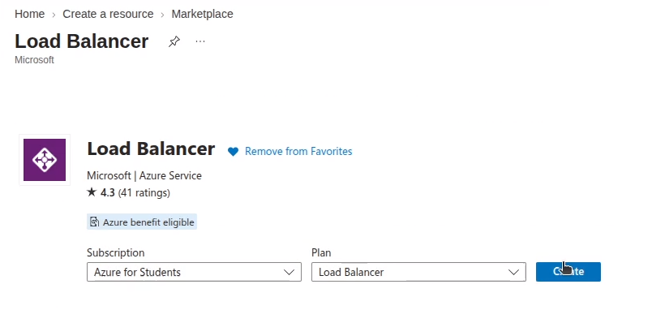

2. Pada tab Basics:
   - Resource group: resource group bersama milik tim
   - Name: `lb-team01-breakout`
   - Region: sama seperti yang lainnya
   - SKU: Standard
   - Type: Public
   - Tier: Regional

   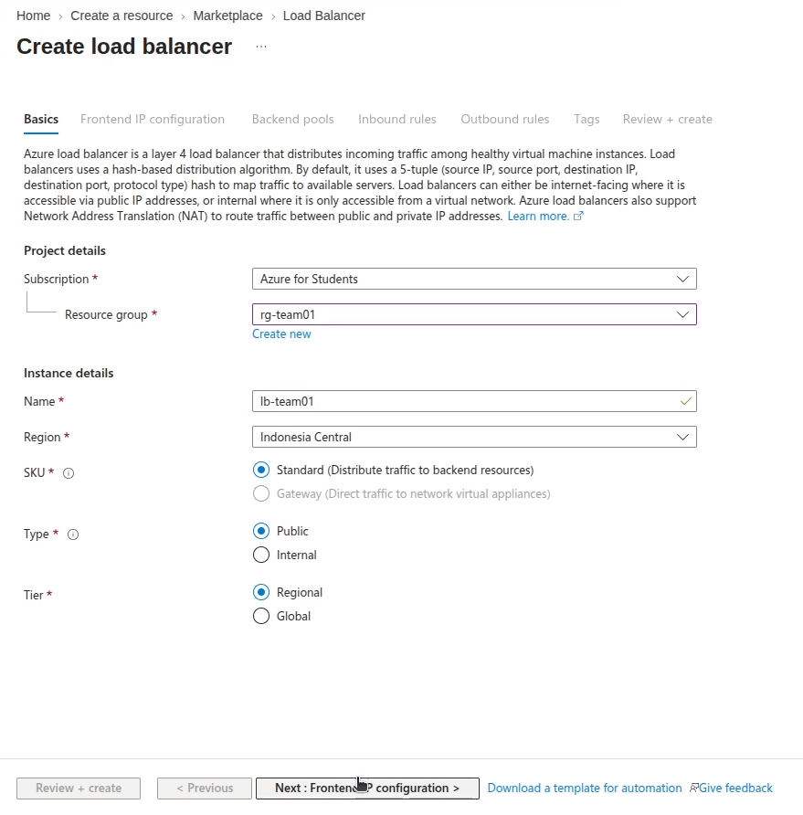

3. Pada tab Frontend IP configuration, tambahkan frontend IP baru dan pilih Standard Public IP yang dibuat di 12.1.

   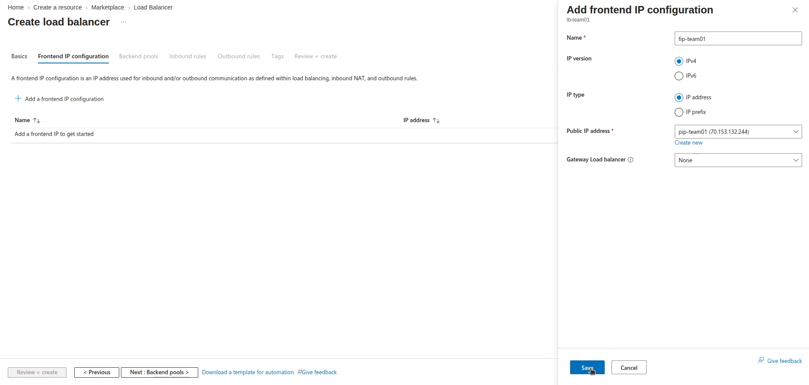

### 12.3 Buat Backend Pool

1. Buka resource load balancer yang baru dibuat.
2. Pilih **Backend pools** dari menu sebelah kiri, lalu **Add**.
3. Beri nama, contohnya `bp-team01-breakout`.
4. Virtual network: pilih `vnet-team01` bersama.
5. Di bawah konfigurasi IP, pilih **Add**, dan tambahkan VM masing-masing anggota tim satu per satu.
   
   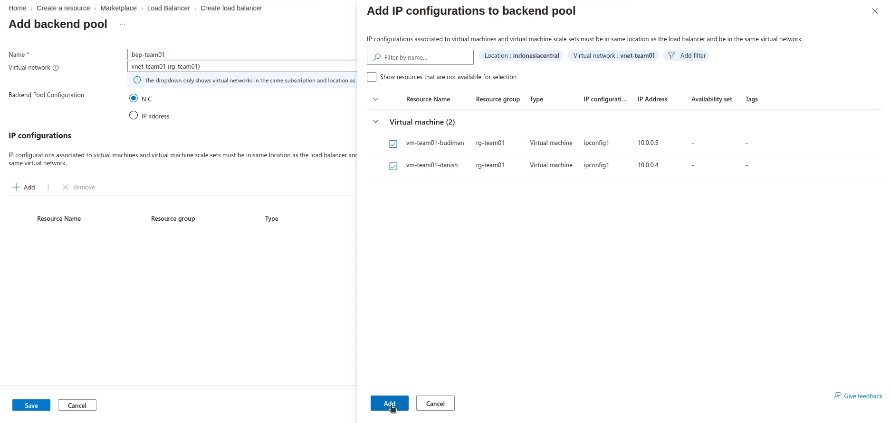

6. Pilih **Save**.

Jika ada VM yang tidak muncul dalam daftar di sini, kemungkinan besar VM tersebut dibuat di virtual network yang berbeda. Pastikan VM tersebut dibuat persis mengikuti Bagian 2.

### 12.4 Buat Health Probe

1. Pilih **Health probes** dari menu sebelah kiri, lalu **Add**.
2. Konfigurasikan:
   - Name: `hp-team01-breakout`
   - Protocol: HTTP. Aplikasi Breakout dengan andal (reliably) mengembalikan HTTP 200 biasa di path root tanpa memerlukan login atau status (state), sehingga tidak perlu kembali (fall back) ke probe TCP biasa di sini.
   - Port: `8080`
   - Path: `/`
   - Interval: `5` detik
   - Unhealthy threshold: `2`
   
   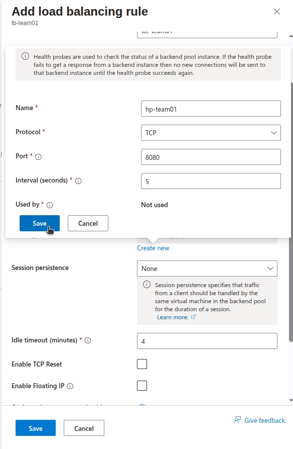

   *catatan: baik HTTP atau TCP tidak apa-apa, asalkan konsisten di seluruh lab*

3. Pilih **Add**.

### 12.5 Buat Aturan Load Balancing (Load Balancing Rule)

1. Pilih **Load balancing rules** dari menu sebelah kiri, lalu **Add**.
2. Konfigurasikan:
   - Name: `rule-team01-breakout`
   - IP Version: IPv4
   - Frontend IP address: frontend IP yang dibuat di 12.1
   - Backend pool: `bp-team01-breakout`
   - Protocol: TCP
   - Port: `80`
   - Backend port: `8080`
   - Health probe: `hp-team01-breakout`
   - Session persistence: None (jangan ubah ini, lihat catatan penting di Bagian 13 tentang mengapa hal ini saja tidak akan membuat browser refresh berganti-ganti di setiap saat)
   - Idle timeout: `4` menit (defaultnya tidak masalah)

Perhatikan bahwa port frontend (`80`) dan port backend (`8080`) berbeda, dan itu disengaja. Aturan load balancing tidak mengharuskan keduanya cocok. Load balancer mendengarkan (listens) pada port 80 untuk siapa saja yang mengunjungi IP publiknya, sehingga peserta cukup mengetik `http://<ip-publik>` tanpa nomor port, tetapi secara internal load balancer tetap meneruskan setiap permintaan ke port 8080 di VM mana pun yang dipilihnya, yang merupakan port aktual tempat kontainer mendengarkan (listening). Tidak ada hal tentang VM, kontainer, atau aturan NSG yang berubah karena ini, hanya listener frontend load balancer itu sendiri yang berubah.
   
   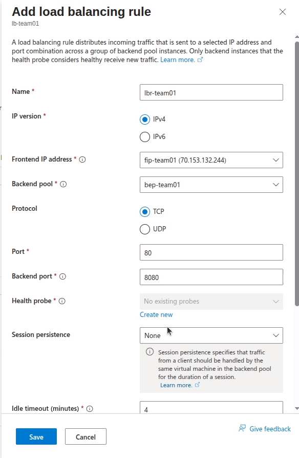

3. Pilih **Add**.

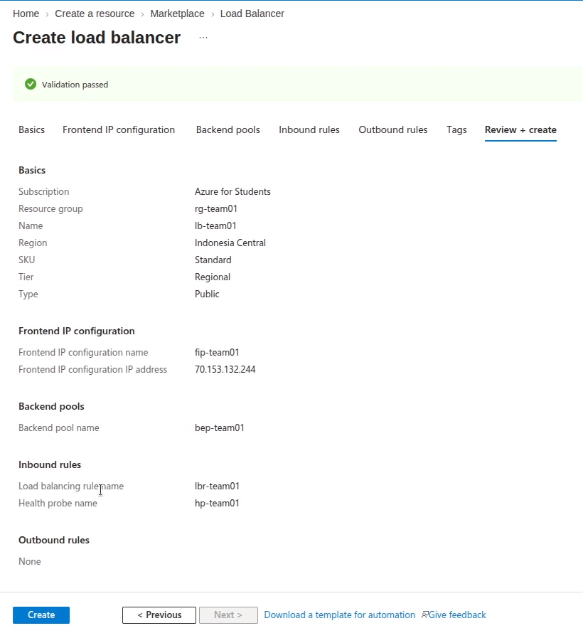

Pada titik ini keseluruhan rantai (chain) telah ada: frontend IP, backend pool dengan semua VM tim, health probe yang memeriksanya, dan aturan (rule) yang menghubungkan keduanya.

---

## 13. Bagian 6: Uji dan Buktikan Load Balancing Berfungsi

### 13.1 Penting: mengapa refresh browser saja bukan pengujian yang dapat diandalkan

Sebelum menguji, pahamilah hal ini, karena ini adalah bagian paling membingungkan dari keseluruhan modul dan setiap tim kemungkinan besar akan mengalaminya.

Azure Standard Load Balancer bekerja pada Layer 4 (layer transport). Alat ini mendistribusikan lalu lintas berdasarkan hash dari IP sumber, port sumber, IP tujuan, port tujuan, dan protokol, bukan berdasarkan setiap permintaan HTTP individual. Tab browser terus menggunakan kembali (reuses) IP sumber dan port sumber yang sama, dan sering menggunakan kembali koneksi terbuka yang sama melalui keep-alive, di banyak refresh (penyegaran). Kombinasi tersebut berarti satu tab browser dapat mendarat di VM yang sama untuk waktu yang lama, lalu tiba-tiba melompat ke VM lain setelah koneksi idle (menganggur) berakhir dan di-hash ulang (rehashed). Ini adalah perilaku yang normal dan diharapkan untuk load balancer Layer 4, ini bukan pertanda bahwa *Session persistence* salah dikonfigurasi, dan ini bukan bug (kutu) pada setup.

Jika Anda ingin setiap refresh halaman secara visual bergantian di antara backend setiap saat tanpa kecuali, hal itu memerlukan perangkat Layer 7 (Azure Application Gateway), yang membuat keputusan perutean (routing) per permintaan HTTP, bukan per koneksi. Itu adalah resource Azure yang berbeda dengan setupnya sendiri, di luar cakupan (out of scope) modul ini. Standard Load Balancer, yang digunakan di sini, benar-benar melakukan pekerjaannya dengan benar meskipun tab browser tidak secara visual bergantian di setiap penyegaran (refresh).

### 13.2 Sebelum Anda Menguji di Browser: Nonaktifkan Auto-HTTPS

Sebagian besar browser modern sekarang mencoba HTTPS terlebih dahulu setiap kali Anda mengetikkan alamat IP atau domain secara langsung ke baris alamat (address bar), bahkan jika Anda tidak pernah mengetik `https://` sendiri. Load balancer Anda hanya melayani HTTP biasa, tidak ada sertifikat TLS yang dikonfigurasi pada load balancer, jadi upgrade (pembaruan) otomatis ini akan gagal atau menampilkan halaman peringatan keamanan (security warning page) alih-alih aplikasi Anda, meskipun sebenarnya tidak ada yang salah dengan load balancer tersebut.

Ada dua hal yang dapat memperbaikinya, lakukan keduanya:

1. **Selalu ketik awalan `http://` secara eksplisit.** Mengetik hanya `<public-ip>` atau `<public-ip>/` pada baris alamat adalah pemicu (trigger) percobaan HTTPS otomatis pada sebagian besar browser. Mengetik `http://<public-ip>` sepenuhnya memberi tahu browser apa persisnya yang Anda inginkan dan biasanya menghindari percobaan pembaruan sepenuhnya.
2. **Jika halaman peringatan masih muncul** ("Koneksi Anda tidak bersifat pribadi / Your connection is not private," "Situs ini tidak dapat menyediakan koneksi yang aman / This site can't provide a secure connection," atau semacamnya), setelan hanya HTTPS (HTTPS-only) di browser Anda diaktifkan dan memblokir fallback alih-alih mengizinkannya. Matikan setelan tersebut:
   - **Chrome atau Edge**: buka `chrome://settings/security` (atau `edge://settings/privacy`), temukan **Always use secure connections** (Selalu gunakan sambungan aman - Chrome) atau **Automatically switch to HTTPS connections whenever possible** (Secara otomatis beralih ke koneksi HTTPS jika memungkinkan - Edge), lalu matikan.
   - **Firefox**: buka `about:preferences#privacy`, scroll ke **HTTPS-Only Mode** (Mode Hanya-HTTPS), lalu atur ke **Don't enable HTTPS-Only Mode** (Jangan aktifkan Mode Hanya-HTTPS), atau tambahkan pengecualian (exception) untuk IP khusus ini jika Anda lebih suka membiarkan setelan ini tetap menyala (on) pada umumnya.
   
   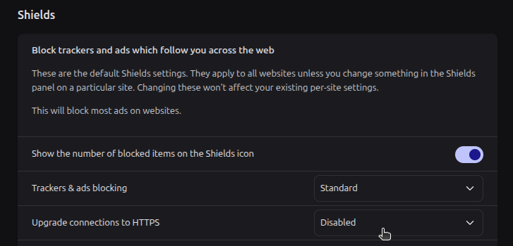
   *catatan: gambar diambil dari browser brave, tetapi konsepnya sama*

Ini hanya memengaruhi navigasi browser. Hal ini tidak berpengaruh pada `curl`, yang mana itulah mengapa perulangan (loop) di Bagian 13.3 berfungsi mengabaikan pengaturan browser apa pun.

### 13.3 Pengujian yang sebenarnya: loop curl, bukan refresh browser

1. Temukan alamat IP publik load balancer, baik dari resource Public IP yang dibuat di 12.1 atau dari halaman Overview load balancer.
2. Pertama, pastikan health probe berhasil dijalankan (passing). Buka **Insights** atau periksa status masing-masing instance backend (backend instance status) di bawah backend pool. Semua VM harus ditampilkan sehat (healthy) sebelum menguji lalu lintas (traffic).
   
   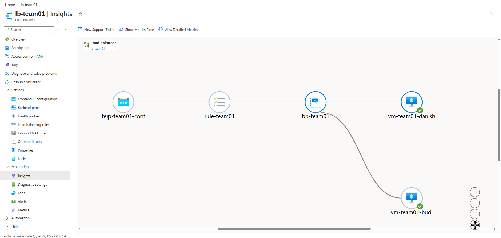

3. Dari mesin lokal Anda, bukan dari dalam sesi SSH kedua VM, jalankan:
   ```bash
   for i in $(seq 1 10); do
     curl -s http://<ip_publik_load_balancer>/config.js
     echo ""
   done
   ```
   Tidak ada nomor port yang diperlukan di sini, karena frontend load balancer mendengarkan (listens) pada port 80, default untuk plain HTTP. Setiap pemanggilan `curl` akan membuka koneksi baru tanpa penggunaan ulang *keep-alive*, yang persis menjadi alasan pengujian ini dapat dipercaya ketika *browser refresh* tidak bisa. Menuju (Hitting) `/config.js` secara spesifik, daripada halaman HTML penuh, memberikan jawaban satu baris (one-line) yang bersih per permintaan, misalnya:
   ```javascript
   window.APP_CONFIG = { hostname: "budi" };
   window.APP_CONFIG = { hostname: "danish" };
   window.APP_CONFIG = { hostname: "budi" };
   ```
4. Catat output-nya (hasilnya). Ini adalah bukti bahwa lalu lintas (traffic) sedang didistribusikan. Sebuah tim akan melihat permintaan dijawab oleh lebih dari satu VM di antara 10 upaya tersebut.
   
   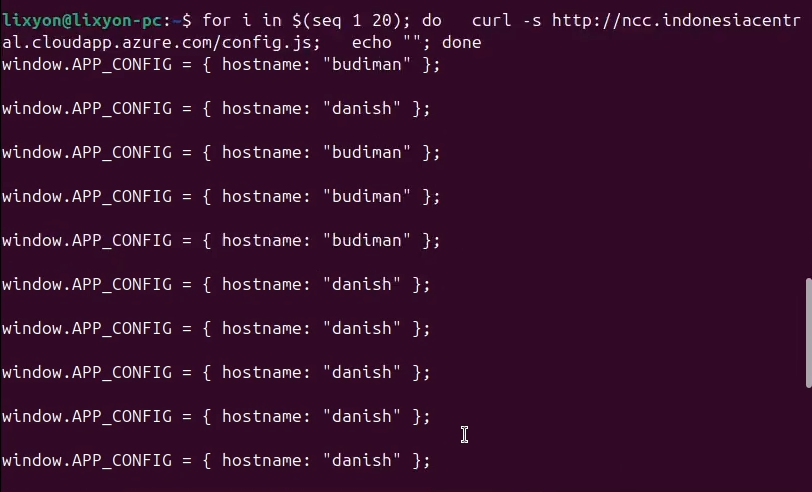

5. Opsional, juga buka `http://<ip_publik_load_balancer>` di browser (dengan awalan `http://` yang diketik secara eksplisit, sesuai Bagian 13.2) untuk melihat game sebenarnya dan konfirmasi bahwa game dimuat (loads) dengan benar *end to end*. Jangan menganggap (treat) tab browser yang menetap pada satu nama host (hostname) untuk sementara waktu sebagai sebuah kegagalan, hal itu telah diperkirakan mengingat Bagian 13.1. Jika Anda ingin melihat perubahan yang terlihat (visible change) di browser tanpa menunggu koneksi terputus (time out), membuka sebuah jendela privat/incognito (penyamaran) baru (fresh) untuk setiap pemeriksaan (check) akan mendekati sifat dari *curl loop*, meskipun itu tidak menjamin sebuah pergantian (alternation) secara pasti di setiap waktu pemuatan (load).

 

Jika perulangan (loop) *curl* itu sendiri, bukan hanya browser, menampilkan VM yang sama persis di seluruh 10 permintaan tanpa ada pengecualian (exceptions), maka periksa *Session persistence* dalam *load balancing rule* (seharusnya "None") dan konfirmasi bahwa *health probe* menampilkan seluruh *backends* dalam keadaan sehat (*healthy*) ketimbang hanya satu.

---

## 14. Bagian 7 (Opsional namun Disarankan): Mensimulasikan Kegagalan

Langkah ini singkat dan membuat konsep *health probes* menjadi nyata.

1. SSH ke dalam salah satu VM anggota tim.
2. Hentikan kontainer yang sedang berjalan:
   ```bash
   docker stop breakout
   ```
3. Tunggu sekitar 15 hingga 20 detik agar *health probe* dapat mendeteksi perubahan tersebut (berdasarkan pada interval dan threshold yang diatur dalam Bagian 12.4).
4. Periksa kembali status kesehatan backend pool. VM tersebut kini seharusnya menunjukkan tanda tidak sehat (*unhealthy*).
5. Jalankan ulang *curl loop* terhadap `/config.js` pada Bagian 13.3. Kini, setiap respons seharusnya hanya akan menampilkan *hostname* dari VM yang tersisa yang berstatus sehat (*healthy*).
6. Jalankan ulang kontainer tersebut:
   ```bash
   docker start breakout
   ```
7. Setelah interval *probe* sukses berikutnya, konfirmasikan bahwa VM telah kembali ke status sehat (*healthy state*) dan mulai menerima lalu lintas (traffic) lagi, serta muncul kembali di dalam hasil *curl loop*.

Hal ini mendemonstrasikan fungsi dari *health probe* yang sesungguhnya: secara otomatis mengalihkan *routing* yang melewati *instance* yang gagal, tanpa intervensi (turun tangan) orang lain secara manual.

---

## 15. Pemecahan Masalah (Troubleshooting)

| Gejala (Symptom) | Kemungkinan penyebab | Solusi (Fix) |
|---|---|---|
| Backend pool kosong atau VM tidak muncul sebagai opsi | VM berada di virtual network yang berbeda dengan load balancer | Buat ulang VM di dalam `vnet-team01` bersama, atau konfirmasi VNet yang benar dipilih saat pembuatan |
| Health probe menampilkan semua backend tidak sehat (unhealthy) | Tidak ada aturan NSG yang mengizinkan port 8080 | Selesaikan Bagian 4 untuk setiap VM |
| Health probe menampilkan (shows) tidak sehat tetapi *curl* berfungsi langsung ke VM | Kesalahan pada *health probe path* atau *protocol* | Pastikan probe adalah HTTP di *path* `/`, port `8080`, yang secara tepat sesuai (matching) dengan Bagian 12.4 |
| *Browser refresh* (penyegaran peramban) terus menampilkan *hostname* VM yang sama beberapa saat, namun pada akhirnya berubah | Hal ini telah diperkirakan, bukan sebuah kutu (bug). *Standard Load Balancer* mendistribusikannya di *Layer 4*, berdasarkan pada sebuah campuran (hash) IP dan *port* sumber (source) serta koneksi yang digunakan kembali, bukannya *per HTTP request* | Jangan menghakimi pendistribusian tersebut dari *browser refresh*. Gunakan fungsi dari perulangan *curl* (curl loop) untuk `/config.js` dari Bagian 13.3, di mana sebuah koneksi baru dapat terbuka setiap waktu dan memunculkan jawaban yang nyata |
| Browser menampilkan *security warning* (peringatan keamanan), atau "*connection is not private* (koneksi tidak pribadi)," ketika mengunjungi IP *load balancer* | Browser mencoba meningkatkan (*auto-upgrade*) *request* ke HTTPS secara otomatis, di mana tidak dilayani oleh *load balancer* ini | Selalu ketik `http://` secara eksplisit pada *address bar* (bar alamat), dan apabila terdapat peringatan (warning) masih muncul, nonaktifkan (disable) pengaturan *HTTPS-only* dari browser setiap saat sesuai dengan Bagian 13.2 |
| Perulangan *curl* (curl loop) itu sendiri, bukan hanya *browser*, memunculkan VM yang sama persis setiap saat tanpa pengecualian sedikit pun | *Session persistence* (persisten sesi) tidak diatur menjadi *None* | Sunting *load balancing rule* dan tetapkan *Session persistence* (persisten sesi) menjadi *None* |
| Tidak dapat menjangkau (reach) aplikasi secara langsung dari IP publik dari VM | *NSG rule* hilang atau port yang dimasukkan salah | Periksa kembali (*Recheck*) Bagian 4 bagi VM spesifik (khusus) tersebut |
| `docker logs breakout` menampilkan *hostname* bertuliskan `unknown` ketimbang menggunakan nama VM (VM name) yang nyata | Kontainer sedang bekerja (started) tanpa kehadiran `-e VM_HOSTNAME=$(whoami)`, atau kembalinya (returned) `$(whoami)` hampa (nothing) pada bagian shell tersebut | Jalankan ulang (*Re-run*) perintah (command) `docker run` dari Bagian 3 yang telah disertakan bendera (flag), pastikan baris perintah (command) sederhana dari `whoami` berfungsi pada VM tersebut lebih dulu |
| Rekan kerja tim (Teammate) tidak dapat memantau *shared resource group* (grup sumber daya bersama) | Penerapan peran (*Role assignment*) tidak diselesaikan, atau sebuah undangan tidak disetujui (accepted) | Periksa kembali (*Recheck*) Bagian 0, dan pastikan peran (*role*) dari *Contributor* diterapkan kepada *email* yang benar |
| Adanya kekeliruan (Error) saat proses *creating a VM* (pembuatan mesin virtual): keberadaan dari sebuah *resource provider* semacam Microsoft.Compute maupun Microsoft.Storage tidak didaftarkan (not registered), serta adanya ketiadaan kewenangan dari akun tersebut bagi proses registrasi (permission to register it) | Persetujuan keikutsertaan (Contributor access) telah dilimpahkan bagi skala dari resource group (resource group level) hanya, di mana belum dirasa mencukupi keperluan pendaftaran *resource provider* secara perdana (for the first time) | Berikan instruksi (Have the) *Team Owner* untuk masuk (*sign in*) dan meregistrasi keberadaan pendukung (*providers*) yang belum ada di bawah Subscriptions > Settings > Resource providers, sebagaimana tercantum di dalam Bagian 0, poin (step) 6. Persoalan ini hanya butuh untuk sekali penerapan dari setiap langganan (*subscription*) |

---

## 16. Pengingat Pembersihan

Standard Load Balancer, Standard Public IP, dan VM yang sedang berjalan secara terus-menerus mengonsumsi kredit Azure for Students selama layanan tersebut ada (exists), tidak hanya selagi ada dalam pemakaian aktif. Jika proyek akhir akan menggunakan kembali setup yang sama persis pada pekan mendatang, tidak apa untuk membiarkannya berjalan, tetapi tim harus:

- Menghentikan (*deallocate*) VM ketika tidak bekerja secara aktif, bukan hanya menutup sesi SSH
- Memonitor (memantau) sisa kredit pada Azure Portal di bawah **Cost Management**
- Secara penuh menghapus *resource group* di ujung proyek akhir segera setelah selesainya ajang *showcase*

---

## 17. Ringkasan Tugas / Pos Pemeriksaan

Pada akhir sesi ini, setiap tim semestinya telah mampu menghasilkan:

1. Sebuah *resource group* yang dibagikan berisikan sebuah *virtual network*, 2 sampai 3 buah VM (satu dari masing-masing *teammate*), dan sebuah *load balancer*
2. Setiap VM mengeksekusi kontainer Breakout LB Demo dengan *hostname*-nya masing-masing yang diinjeksi (injected) secara tepat, dan telah terkonfirmasi melalui `docker logs`
3. Aturan-aturan *NSG* (NSG rules) yang membiarkan (allowing) port 8080 pada setiap VM
4. Sebuah *load balancer* yang bekerja (working) dengan keberadaan dari *backend pool* dalam kondisi sehat (*healthy*)
5. Sebuah tangkapan layar atau rekaman dari terminal berkenaan dengan `curl` loop terhadap `/config.js` di mana merekam bahwa permintaan (requests) direspons (answered) oleh *hostname* milik lebih dari satu VM
6. (Opsional) Sebuah tangkapan layar yang menampilkan keberadaan *backend pool* memberikan label (marking) secara tepat bagi sebuah *instance* terhenti (stopped instance) selaku sebuah komponen yang rusak (*unhealthy*)
